# Hardening Guide - macOS 26 Tahoe

- [Hardening Guide - macOS 26 Tahoe](#hardening-guide---macos-26-tahoe)
- [Introduction](#introduction)
  - [Scope \& Application](#scope--application)
  - [How-to Read and Use This Document](#how-to-read-and-use-this-document)
  - [Disclaimer on Intel-based Macs](#disclaimer-on-intel-based-macs)
- [macOS System Security](#macos-system-security)
  - [Secure Boot](#secure-boot)
  - [Ensure System Integrity Protection Is Enabled](#ensure-system-integrity-protection-is-enabled)
  - [Ensure System Volume Is Read-Only](#ensure-system-volume-is-read-only)
  - [Enable Authenticated Root](#enable-authenticated-root)
  - [Gatekeeper](#gatekeeper)
  - [Firmware Password (Intel-based Macs)](#firmware-password-intel-based-macs)
  - [FileVault](#filevault)
    - [Restrict Users](#restrict-users)
  - [Disable System Diagnostic and Usage Data Reporting](#disable-system-diagnostic-and-usage-data-reporting)
  - [Lockdown Mode (Optional)](#lockdown-mode-optional)
  - [External Accessory](#external-accessory)
  - [Secure Enclave and Hardware-Security](#secure-enclave-and-hardware-security)
  - [Volume Ownership (Secure Token)](#volume-ownership-secure-token)
  - [System Extensions and Driver Management](#system-extensions-and-driver-management)
  - [System Services \& Persistence (Daemon Management)](#system-services--persistence-daemon-management)
    - [System Services and Persistence](#system-services-and-persistence)
- [Authentication](#authentication)
  - [Users Privilege Separation](#users-privilege-separation)
  - [Ensure Password Security - Password Policy](#ensure-password-security---password-policy)
  - [Disable Automatic Login and User List](#disable-automatic-login-and-user-list)
  - [Screensaver and Unlocking](#screensaver-and-unlocking)
  - [Disable Touch ID \& Unlock with Apple Watch](#disable-touch-id--unlock-with-apple-watch)
  - [Disable Guest Accounts](#disable-guest-accounts)
    - [Disable the Guest Account](#disable-the-guest-account)
    - [Disable Guest Account Access to File Shares](#disable-guest-account-access-to-file-shares)
  - [Restrict Sudoers File](#restrict-sudoers-file)
  - [Automatically Lock the Login Keychain (Optional)](#automatically-lock-the-login-keychain-optional)
  - [Require Administrator Password](#require-administrator-password)
  - [Login Items](#login-items)
  - [macOS Password Manager \& Keychain](#macos-password-manager--keychain)
  - [Passkeys and FIDO2 Hardening](#passkeys-and-fido2-hardening)
  - [Touch ID for Sudo (Optional)](#touch-id-for-sudo-optional)
- [Updates \& Time](#updates--time)
  - [Operating System Updates](#operating-system-updates)
  - [Enable Network Time Synchronization via NTP](#enable-network-time-synchronization-via-ntp)
- [Secure Storage of Data \& Backups](#secure-storage-of-data--backups)
  - [Time Machine Backups](#time-machine-backups)
    - [Disable Automatic Prompt](#disable-automatic-prompt)
  - [Finder: Show All File Extensions](#finder-show-all-file-extensions)
  - [Disable Creation of Metadata Files](#disable-creation-of-metadata-files)
  - [Setuid and Setgid](#setuid-and-setgid)
  - [Set Strict Global Umask (Optional)](#set-strict-global-umask-optional)
- [Network Communication Hardening \& Privacy](#network-communication-hardening--privacy)
  - [Enable macOS Firewall](#enable-macos-firewall)
    - [Packet Filter (Optional)](#packet-filter-optional)
  - [Disable Power Nap and Network Wake](#disable-power-nap-and-network-wake)
  - [Disable Handoff \& Universal Control](#disable-handoff--universal-control)
    - [Disable Handoff](#disable-handoff)
    - [Disable Universal Control](#disable-universal-control)
  - [Change Computer-/Hostname](#change-computer-hostname)
  - [Disable AirDrop](#disable-airdrop)
  - [Disable Network Services \& Sharing](#disable-network-services--sharing)
  - [Disable iCloud Services](#disable-icloud-services)
  - [Disable Proximity Based Password Sharing](#disable-proximity-based-password-sharing)
  - [Disable AirPlay Receiver](#disable-airplay-receiver)
  - [Restrict SSH Client Ciphers and Algorithms](#restrict-ssh-client-ciphers-and-algorithms)
  - [Privacy, Permissions \& Location Services](#privacy-permissions--location-services)
  - [Post-Quantum Cryptography (PQC)](#post-quantum-cryptography-pqc)
  - [Apple Intelligence \& Siri](#apple-intelligence--siri)
- [Application \& Software Integrity](#application--software-integrity)
  - [Software Management and Third-Party Sources](#software-management-and-third-party-sources)
  - [XProtect \& Malware Remediation](#xprotect--malware-remediation)
  - [Application Sandboxing](#application-sandboxing)
- [Additional Security Hardening](#additional-security-hardening)
  - [SSH Secret Management](#ssh-secret-management)
    - [Use of Host-Specific Keys and Config](#use-of-host-specific-keys-and-config)
    - [Generate and Manage SSH Keys in Secure Enclave](#generate-and-manage-ssh-keys-in-secure-enclave)
  - [Files in Encrypted Disk Images](#files-in-encrypted-disk-images)
    - [Creating a Secure Disk Image via Disk Utility](#creating-a-secure-disk-image-via-disk-utility)
    - [Creating a Secure Disk Image via Terminal](#creating-a-secure-disk-image-via-terminal)
    - [Mounting a Secure Disk Image](#mounting-a-secure-disk-image)

# Introduction

This document provides a base hardening guideline for macOS 26 “Tahoe” to enhance the system security while remaining commonly usable in most scenarios used for macOS clients.

## Scope & Application

This hardening guide covers the recommendations for hardening a Mac using the macOS operating system in version 26 Tahoe. The controls described as *mandatory* for client systems are strongly recommended to be implemented by the system owner.

Settings that might have a severe impact on the operating system’s functionality and need a lot of further testing are not part of this guide or are marked as optional. Further, this guide does not claim to be complete. For example, the hardening of a system relies not only on the operating system but also on installed and used third-party software.
Please note that some of the strict settings that we discuss might be in contradiction to Apple's own guidance on how to use certain features (e.g., in the Platform Security Guide). The reader is encouraged to fully understand the implications of individual settings before applying the guidance provided in this document.

## How-to Read and Use This Document

Each recommended setting in this hardening guide is *mandatory* unless marked as *optional*. The controls are described using the terms MUST or MUST NOT (mandatory) or SHOULD (optional) as defined in RFC 2119[^1]. *Optional* hardening settings mean that it is recommended to apply this setting, but there may be required functionality on the system that will become unavailable once the setting is applied. Further notes are added to *Optional* settings if they significantly impact the user experience.

The code samples used in this document illustrate the implementation of the controls as well as checking for compliance with the controls. The commands are tested on the supported macOS systems and can potentially be used on other systems; however they may differ in function and effect. Some commands may need superuser privileges for successful execution.

The following formatting/semantics are used for the presentation of commands/code:

- Expressions of style “`> command`” mean the execution of a command.
- A line without “`>`” after a command is equivalent to the output of the command.
- A line without the leading “`>`” contains a single command without output.
- A line with the leading “`\#`” in a configuration file is a comment
- Code/Commands are formatted as follows:

    > chmod 0700 /home/USER

- Notes are formatted as follows:

> **Note:** This is an example Note.

## Disclaimer on Intel-based Macs

This version of the hardening guide covers macOS 26 Tahoe, which is the **last** major operating system release supporting Intel-based Mac hardware. Security checks and configuration guides for Intel-Macs will not be updated beyond this version of macOS.

# macOS System Security

This section describes essential macOS system security and integrity mechanisms.

## Secure Boot

In this section, the security settings for the secure boot of a Mac are detailed. Consult *Mac models with the Apple T2 Security Chip*[^2] and *Mac computers with Apple Silicon*[^3] to learn which Mac computers have either the Apple T2 Security Chip or Apple Silicon chip. Intel Macs had a built-in T2 chip that handled security and other features on the Macs, but with the M1 chips, that functionality is built right in, and a second chip is not required.

###### Startup Security for Intel-based Macs

MacBook models (with Intel processor) since 2018 support secure boot through their included T2 chip inside the *TouchBar* including the Secure Enclave.

###### Description

The Mac needs to be booted with the Command and R key pressed to check if Secure Boot is enabled[^4]. After entering the Firmware Password or authenticating with FileVault users, it is possible to access the *Startup Security Utility* in the Menu bar. If the MacBook contains a T2 Chip (*TouchBar*), it is possible to see the options for *Secure Boot* and *External Boot*. It is highly recommended to have *Secure Boot* on Full Security and *External Boot* on Disallow booting from external media. For more information about these settings, see *About Startup Security Utility on a Mac with the Apple T2 Security Chip*[^5].

*Full security* is the default Secure Boot setting in macOS. During startup, when Secure Boot is set to *Full Security*, the Mac will verify the integrity of the operating system before allowing the operating system to boot.

###### Compliance Check

To check the settings of secure boot, run the following command. Please note that this will only return an accurate result on a T2 or Intel Macs. The subsequent output is returned from a MacBook Pro (15-inch, 2018) with a T2 chip. The settings MUST be adjusted to these values to ensure system security.

    > sudo /usr/libexec/mdmclient QuerySecurityInfo | grep "SecureBoot =" -A 4
    SecureBoot = {
     ExternalBootLevel = disallowed;
     SecureBootLevel = full;
     WindowsBootLevel = disallowed;
    };

###### Implementation

Boot the Mac with the Command and R key pressed. Enter the Firmware Password or authenticate with a FileVault user. Access the *Startup Security Utility* in the Menu bar. Set the options for *Secure Boot* to *Full Security* and *External Boot* to *Disallow*.

###### Startup Security for Apple Silicon-based Macs

Apple Silicon Macs (M1 and later) include a LocalPolicy file feature that lets administrators or users control what types of software the computer can run. The LocalPolicy file is a signed binary that contains settings related to boot security, and it’s typically used to restrict the system to only boot signed and trusted operating systems, for example. When a Mac with Apple Silicon[^6] is turned on, it performs a boot process much like iPhone and iPad[^7]. In contrast to security policies on Intel-based Mac computers, security policies on a Mac with Apple Silicon are supported for each installed operating system. This means that multiple installed macOS instances with different versions and security policies can exist on the same machine. For this reason, an operating system picker has been added to System Security Utility.[^8]

###### Description

There are three security policies[^9] for a Mac with Apple Silicon:

- **Full Security:** The system behaves like iOS and iPadOS and allows only booting software known to be the latest available at install time.
- **Reduced Security:** This policy level allows the system to run older versions of macOS. Because older versions of macOS inevitably have unpatched vulnerabilities, this security mode is described as *Reduced*. This is also the policy level required to support booting kernel extensions (*kexts*) without using mobile device management (MDM) solution and Automated Device Enrollment with Apple School Manager or Apple Business Manager.
- **Permissive Security:** This policy level supports users building, signing, and booting custom XNU kernels. System Integrity Protection (SIP) needs to be disabled before enabling Permissive Security Mode.

###### Compliance Check

All local policies MUST be set to *Full Security*.

The current local policies settings can be reviewed using a tool named `bputil`. This tool is only available on Apple Silicon. If you run this tool on `x86_64`, it will output `bputil is not yet supported on this platform`. The following output is returned when running `bputil`:

    > sudo bputil -d
    Password:

    Current local policy:
    OS environment:
    OS Type                                       : macOS
    OS Pairing Status                             : Not Paired
    Local Policy Nonce Hash                 (lpnh): 2723[...]E61F
    Remote Policy Nonce Hash                (rpnh): 3240[...]1EC8
    Recovery OS Policy Nonce Hash           (ronh): C418[...]6B13

    Local policy:
    Pairing Integrity                             : Valid
    Signature Type                                : BAA
    Unique Chip ID                          (ECID): 0x1A31[...]
    Board ID                                (BORD): 0xA
    Chip ID                                 (CHIP): 0x6001
    Certificate Epoch                       (CEPO): 0x1
    Security Domain                         (SDOM): 0x1
    Production Status                       (CPRO): 1
    Security Mode                           (CSEC): 1
    Local Boot                              (lobo): 1
    OS Version                              (love): 23.4.56.0.0,0
    Volume Group UUID                       (vuid): 5948[...]361AC
    KEK Group UUID                          (kuid): 333A[...]1ABD
    Local Policy Nonce Hash                 (lpnh): 2723[...]E61F
    Remote Policy Nonce Hash                (rpnh): 3240[...]1EC8
    Next Stage Image4 Hash                  (nsih): 2261[...]CA3D4
    Cryptex1 Image4 Hash                    (spih): 8260[...]6197
    Cryptex1 Generation                     (stng): 23
    User Authorized Kext List Hash          (auxp): absent
    Auxiliary Kernel Cache Image4 Hash      (auxi): absent
    Kext Receipt Hash                       (auxr): absent
    CustomKC or fuOS Image4 Hash            (coih): absent
    Security Mode:               Full       (smb0): absent
    3rd Party Kexts Status:      Disabled   (smb2): absent
    User-allowed MDM Control:    Disabled   (smb3): absent
    DEP-allowed MDM Control:     Disabled   (smb4): absent
    SIP Status:                  Enabled    (sip0): absent
    Signed System Volume Status: Enabled    (sip1): absent
    Kernel CTRR Status:          Enabled    (sip2): absent
    Boot Args Filtering Status:  Enabled    (sip3): absent

When MUST be a line saying `Security Mode:               Full       (smb0): absent`.

## Ensure System Integrity Protection Is Enabled

###### Description

System Integrity Protection (SIP) MUST be enabled (default). System Integrity Protection restricts components to read-only in specific critical file system locations to help prevent malicious code from modifying them. System Integrity Protection is a computer-specific setting that defaults when a user upgrades to OS X 10.11 or later. Disabling SIP removes protection for all partitions on the physical storage device on an Intel-based Mac. macOS applies this security policy to every process running on the system, regardless of whether it’s running sandboxed or with administrative privileges.[^10]

###### Compliance Check

To check the current status of SIP, run the following command:

    > csrutil status
    System Integrity Protection status: enabled.

###### Implementation

If disabled, to re-enable *System Integrity Protection*, boot the affected system into *Recovery* mode, launch *Terminal* from the *Utilities* menu, and run the following command:

    csrutil enable

> **Note:** You cannot enable System Integrity Protection from the booted operating system.

> **Note:** You should research why SIP was disabled. Furthermore, it is recommended to erase the Mac and reinstall the operating system.

## Ensure System Volume Is Read-Only

###### Description

The System volume MUST be mounted as read-only to ensure that configurations critical to the integrity of the macOS have not been compromised (default). System Integrity Protection (SIP) will prevent the system volume from being mounted as writable.

###### Compliance Check

The following command evaluates whether the system volume is mounted as read-only:

    > system_profiler SPStorageDataType | awk '/Mount Point: \/$/{x=NR+2}(NR==x)'
    Writable: No

###### Implementation

If the result is *Writable: Yes*, the system is uncompliant. Rebooting the computer will mount the system volume as read-only. In this case, the computer MUST be rebooted and the setting re-checked.

## Enable Authenticated Root

###### Description

Authenticated root MUST be enabled (default). When *authenticated root* is enabled, macOS is booted from a signed volume that is cryptographically protected to prevent tampering with the system volume. This is also called *Sealed System Volume (SSV)*[^11].

###### Compliance Check

To check whether *authenticated root* is enabled with the following command:

    > csrutil authenticated-root status
    Authenticated Root status: enabled

###### Implementation

To enable *authenticated root*, boot the affected system into *Recovery mode*, launch *Terminal* from the *Utilities* menu, and run the command:

    csrutil authenticated-root enable

## Gatekeeper

macOS includes a technology called *Gatekeeper*, that shall help to run only trusted software.[^12]

###### Description

Gatekeeper is a security feature that ensures that applications are digitally signed by an Apple-issued certificate before they are permitted to run. Digital signatures allow the macOS host to verify that a malicious third party has not modified the application. Gatekeeper MUST be enabled. Gatekeeper settings MUST be configured correctly only to allow the system to run applications downloaded from the Mac App Store or applications signed with a valid Apple Developer ID code. Administrator users will still have the option to override these settings on a per-app basis. Gatekeeper is a security feature that ensures that applications MUST be digitally signed by an Apple-issued certificate to run. Digital signatures allow the macOS to verify that the application has not been modified by a malicious actor.

###### Compliance Check

This setting can be verified with the following command, which MUST return both output lines:

    > spctl --status --verbose
    assessments enabled
    developer id enabled

###### Implementation

Enable Gatekeeper by running the following command:

    sudo spctl --master-enable

## Firmware Password (Intel-based Macs)

Mac computers with Intel CPU use a Firmware Password to prevent unintended modifications of firmware settings on a specific Mac. For the equivalent level of security on a Mac with Apple Silicon, turn on FileVault.[^13] The firmware password is not required on a Mac with Apple Silicon SOCs, because the critical firmware functionality has been moved into the recoveryOS and (when FileVault is enabled) recoveryOS requires user authentication before its critical functionality can be reached.[^14] Apple Silicon Macs support setting a recoveryOS password MDM[^15]. We will not handle this option in this guide.

###### Set a Firmware Password

A sufficiently complex firmware password MUST be set to prevent Single User Mode and bootable devices. Setting a Firmware Password is especially important to reduce the risk of attacks on Intel-based Mac computers without a T2 chip from physically present attackers. The Firmware Password can help prevent attackers from booting to recoveryOS, from where they could otherwise disable System Integrity Protection (SIP). And by restricting boot of alternative media, attackers cannot execute privileged code from another operating system to attack peripheral firmware.[^16]

Forgetting this password can render the Mac completely unavailable and prevent it from booting. Hence, a password manager storing this password can be a solution. Further, when trying to access a firmware secured part regardless of the real keyboard layout of the MacBook, the English default setting will always be mapped.

If firmware password or passcode is forgotten, the only way to reset the forgotten password is to use a machine-specific binary generated and provided by Apple. Schedule a support call, and provide proof of purchase before the firmware binary will be generated.

###### Compliance Check

Check whether a firmware password is set by running the following command. On Apple Silicon devices the command will lead to an error that indicates that the firmware on the machine is not supported.

    > sudo /usr/sbin/firmwarepasswd -check
    Password Enabled: Yes

###### Implementation

To set a firmware password:

- Boot your Mac into Recovery Mode by pressing Command + R as your Mac is booting.
- Select Utilities → Firmware Password Utility
- Set an adequate complex Password, that MUST fulfill the following requirements:
  - MUST have a minimum password length of at least 32 characters
  - Password MUST consist of at least one character of each character group (letters, numbers, special characters)
  - MUST NOT contain any default passwords
  - MUST consist of at least six different characters

> **NOTE:** *The Firmware Password MUST be stored at a safe place to enable hardware recovery before disabling the capability.*

###### Disable Firmware Password Reset Capability

For users who want no one but themselves to remove their firmware password by software means, the `-disable-reset-capability` option has been added to the `firmwarepasswd` command-line tool in macOS 10.15.

> **NOTE:** *The Firmware Password MUST be stored at a safe place to enable hardware recovery before disabling the capability.*

###### Implementation

To disable the firmware password reset capability by Apple run:

    sudo firmwarepasswd -disable-reset-capability

It is possible to re-enable the password reset capability using the `-enable-reset-capability` command.

## FileVault

Since macOS 13, the internal data volume can be protected by FileVault[^17]. In addition, the system volume is always cryptographically protected (T2 and Apple Silicon) and is a read-only volume. FileVault protects entire internal and external storage volumes. Macs with a secure enclave (T2 and Apple Silicon) use the hardware security features of the architecture to protect the keys. According to Apple[^18], Apple File System (APFS) in macOS 10.13 or later changes how FileVault encryption keys are generated.

###### Enable FileVault

FileVault MUST be enabled to use full disk encryption on the Mac computer. By default, FileVault is turned off. Therefore, it MUST be enabled. FileVault can be enabled in three ways within the macOS. First, FileVault can be enabled via the command line using the `fdesetup` utility, using a configuration profile (not part of this guide), or via the user interface.

###### Compliance Check

The current status of FileVault can be checked via the *System Settings* App via *System Settings → Privacy & Security* and scroll down to *FileVault* as the following <a href="#figure:filevault-disabled" data-reference-type="ref+label" data-reference="figure:filevault-disabled">3.1</a> shows.

<figure id="figure:filevault-disabled">
<div id="figure:filevault-disabled">
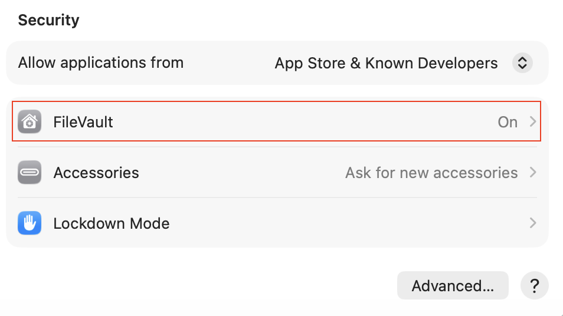
</div>
<figcaption>FileVault status is shown in Privacy &amp; Security → FileVault.</figcaption>
</figure>

Alternatively, FileVault status can be checked via the command line:

    > fdesetup status -extended
    FileVault is On.
    Volume is APFS. (FileVault Enabled)

###### Implementation via the Settings GUI:

You can enable FileVault via the *System Settings* App:

- System Settings → *Privacy & Security*
- Scroll down to *FileVault*
- Click *Turn on…*

You will be prompted to enter your administrative password.

Depending on the current iCloud configuration of the Mac, you might be asked to choose between using your iCloud account or a recovery key to unlock the disk.

If prompted:

- An iCloud account MUST NOT be used as a recovery option.
- Select *Create a recovery key and do not use my iCloud account*.

If you are not signed into iCloud, macOS will automatically generate a recovery key.

> **NOTE:** *The FileVault Recovery Key MUST be stored at a safe place. It is the only way to recover data from the disk if regular access via an administrative user is not possible.*

<figure>
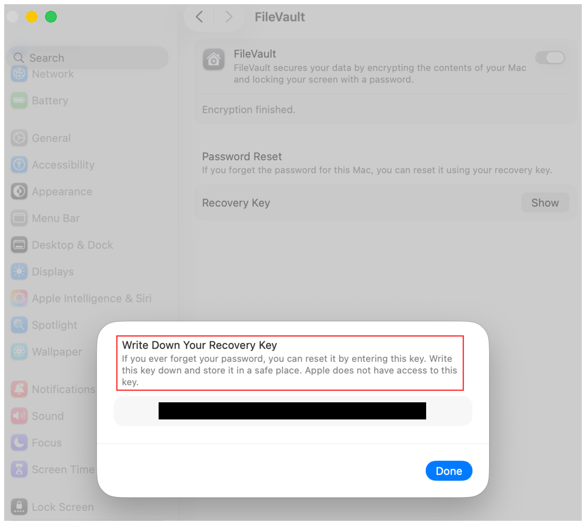
<figcaption>The generated Recovery Key must be saved secureley.</figcaption>
</figure>

After clicking *Continue*, FileVault starts encrypting the disk. The status of FileVault will change to *On*.

###### Implementation via the Command Line

To enable FileVault via the command line, run the following command:

    > sudo fdesetup enable 
    Enter the user name: <username> 
    Enter the password for user '<username>':
    Recovery key = 'GYVE-2KM5-OX2J-LEAZ-BF49-ZTUD'

> **NOTE:** *The FileVault Recovery Key MUST be stored at a safe place. It is the only way to recover data from the disk if regular access via an administrative user is not possible.*

The option `-norecoverykey` to tell FileVault to ommit returning a recovery key MUST NOT be used.

Afterward, the status can be rechecked by running:

    > fdesetup status
    FileVault is On.

The recovery key can be checked via:

    > sudo fdesetup validaterecovery 
    Enter the current recovery key: <YOUR-KEY>

This will return `true` when the recovery key is correct and `false` when the recovery key is wrong.

### Restrict Users

###### Description

macOS MUST be configured to allow authorized users to unlock FileVault upon startup.

###### Compliance Check

To list all users that are permitted to unlock FileVault run:

    > sudo fdesetup list | awk -F ',' '{print $1}'
    ernw

Here, only the user `ernw` is allowed to unlock the disk.

###### Implementation

Remove the users that are not authorized to unlock FileVault using the `fdesetup` command.

    sudo fdesetup remove -user <username>

> **Note:** *It MUST be ensured that at least one administrative user has the permission to unlock FileVault upon startup!*

## Disable System Diagnostic and Usage Data Reporting

###### Description

Apple offers a means of transmitting diagnostic and analytical data to aid in enhancing its platform. The information shared with Apple may include sensitive internal organizational data that should be managed and kept confidential, unavailable for Apple’s processing. All sharing of analytics and improvement data MUST be disabled.

###### Compliance Check

The current value can be read with:

    > defaults read /Library/Application\ Support/CrashReporter/DiagnosticMessagesHistory.plist AutoSubmit
    0
    > sudo defaults read /Library/Application\ Support/CrashReporter/DiagnosticMessagesHistory.plist ThirdPartyDataSubmit
    0
    > defaults read ~/Library/Preferences/com.apple.assistant.support "Siri Data Sharing Opt-In Status"
    2

Alternative, check the settings via the Settings GUI as shown in <a href="#figure:disable-analytics" data-reference-type="ref+label" data-reference="figure:disable-analytics">3.2</a>:

- Open *System Settings*
- Select *Privacy & Security*
- Select *Analytics & Improvements*
- Verify that *Share Mac Analytics* is not enabled
- Verify that *Improve Siri & Dictation* is not enabled
- Verify that *Improve Assistive Voice Features* is not enabled
- Verify that *Share with app developers* is not enabled
- Verify that *Share iCloud Analytics* is not enabled

<figure id="figure:disable-analytics">
<div id="figure:disable-analytics">
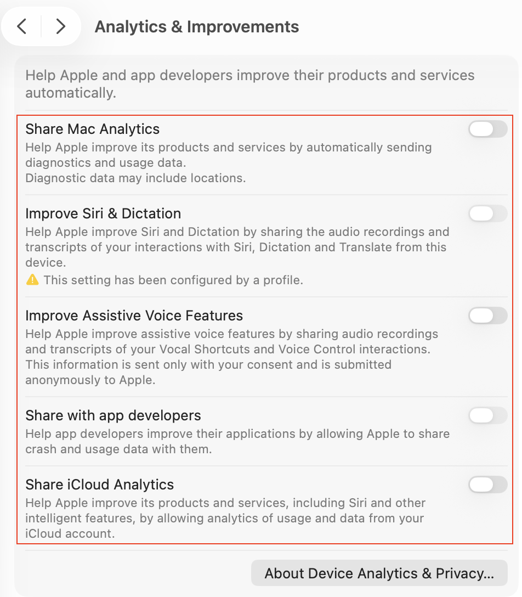
</div>
<figcaption>Disabled Analytics Features in the Settings application.</figcaption>
</figure>

###### Implementation

Disable the service by running:

    defaults write com.apple.CrashReporter DialogType none

The default value can be reset by running:

    defaults write com.apple.CrashReporter DialogType crashreport

Alternatively, set the options via the Settings GUI.

## Lockdown Mode (Optional)

###### Description

Lockdown Mode is an *optional* security posture available on macOS Ventura and later, designed to offer protection against highly sophisticated, targeted digital threats, such as state-sponsored spyware[^19]. When enabled, it hardens the system by significantly reducing the available attack surface.

The mode achieves this by proactively disabling or limiting certain high-risk, complex features in apps, websites, and system services that are common vectors for exploit chains.

###### Technical Restrictions

When **Lockdown Mode** is active, the system implements the following restrictions:

- **Messages:** Most message attachment types are blocked, except for certain images, videos, and audio. Links and link previews are unavailable.
- **Web Browsing:** Complex web technologies, such as Just-In-Time (JIT) compilation for JavaScript, are restricted. This may cause websites to load slowly or function incorrectly. Web fonts may not display, and certain images are substituted with missing image icons.
- **FaceTime:** Incoming FaceTime calls are blocked unless the user has previously initiated contact with the caller.
- **Shared Albums:** Shared Albums are removed from the Photos app, and new invitations are blocked.
- **Device Connections (Apple Silicon):** Mac laptops with Apple Silicon require the Mac to be unlocked, and explicit user approval is needed to connect to an accessory or another computer. This prevents unauthorized data transfer during sleep or from a locked device.
- **Configuration Profiles:** Installation of configuration profiles and enrollment in Mobile Device Management (MDM) or device supervision are blocked while the mode is active.

> **Note:** Essential functionality, such as standard phone calls and plain text messages, along with emergency features like SOS calls, remains unaffected.

###### Implementation

Activating Lockdown Mode is a per-user setting and requires a system restart to fully apply the restrictions.

- Navigate to the *Apple menu* icon and select → *System Settings*.
- Click on *Privacy & Security*.
- Scroll down to the bottom and locate → *Lockdown Mode*.
- Toggle the switch to *Turn On* *Lockdown Mode*.
- If prompted, enter your user password and click → *Turn On & Restart*.

###### Compliance Check

Since Lockdown Mode is a per-user setting, its status must be verified for each local account. The command below checks the status for the current user. A return value of `1` indicates that Lockdown Mode is enabled for that user.

    > defaults read ~/Library/Preferences/.GlobalPreferences.plist LDMGlobalEnabled
    1

If the command returns a `0` value or that the key is missing, Lockdown Mode is currently disabled or has never been enabled for the logged-in user.

## External Accessory

###### Description

Since macOS 13 Ventura, Apple introduced a new security feature for Silicon-based Macs. This feature requires user approval when connecting a new USB accessory, Thunderbolt accessory or SD card with your MacBook. It is advisable to utilize this option to reduce the risk of malicious external devices accessing your MacBook. To ensure the security of your device, the *Ask Every Time* option MUST be activated.

###### Compliance Check

Confirm your device settings by following these steps:

- Go to → *System Settings*
- Click on → *Privacy & Security*
- Scroll down
- Click on the option *Accessories*
- Ensure that *Always ask* is selected.

<figure id="figure:accessory-ask-connect">
<div id="figure:accessory-ask-connect">
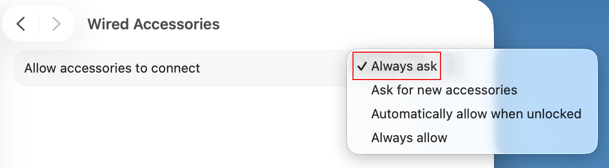
</div>
<figcaption>Configuring connecting accessories to ask every time.</figcaption>
</figure>

## Secure Enclave and Hardware-Security

This section details the mandatory requirements for utilizing the hardware-based security capabilities of macOS. The security of macOS Tahoe 26 fundamentally relies on the Secure Enclave (SE), a dedicated subsystem incorporated into Apple Silicon and the Apple T2 Security Chip.

###### Secure Enclave Architecture

The Secure Enclave is a hardware-based key manager isolated from the main processor to provide an extra layer of security. It is responsible for:

- **Key Management:** Protecting the cryptographic keys for FileVault and the Keychain.
- **Biometrics:** Processing Touch ID and Face ID data securely.
- **Boot Integrity:** Validating the OS kernel during the boot process.

The method of verification depends on the device architecture:

- **Apple Silicon Macs (M1, M2, M3, etc.):** All Macs with Apple Silicon have the Secure Enclave built directly into the main chip (SoC).
- **Intel-based Macs:**: Intel Macs must contain the *Apple T2 Security Chip* to be compliant. Older Intel models without the T2 chip lack the necessary hardware root of trust.
- Click the *Apple Menu* → *System Settings* → *General* → *About* to check the existing hardware.

Alternatively, the following command can be used:

    > system_profiler SPHardwareDataType SPControllerDataType | grep -E "Chip:"

## Volume Ownership (Secure Token)

###### Description

*Volume Ownership* is a core security concept on modern macOS devices, particularly on Macs with Apple Silicon. It represents the cryptographic linkage between a local user account and the encryption keys required to perform critical actions on the boot volume.

Volume Ownership is granted through the Secure Token, a cryptographic mechanism that allows a user account to manage the FileVault disk encryption key and authorize changes to the boot security policy (e.g., Secure Boot settings in Recovery Mode). The Secure Token is typically granted automatically to the first administrator logging in to a freshly installed macOS system. This process requires a system-level interaction that confirms the user’s root of trust. A Secure Token MUST be enabled for at least one administrative user to:

- Enable or disable FileVault encryption.
- Manage other authorized users for FileVault unlocking.
- Authorize software updates and system extensions.

###### Compliance Check

Compliance is verified by checking the status of the Secure Token for the administrative user intended to manage the system. The command below checks the status for the currently logged-in user, which is assumed to be an administrator.

    > sudo sysadminctl -secureTokenStatus $(id -un)
    2025-11-28 17:34:30.052 sysadminctl[83979:1762080] Secure token is ENABLED for user ernw

If the status is reported as `DISABLED`, the system is non-compliant, and the user cannot perform mandatory security steps like enabling FileVault.

###### Implementation

The preferred and most secure method for granting the Secure Token is through the initial setup process of the Mac, which occurs upon the first login of an administrator account.

If the Secure Token is reported as disabled, it can be manually granted via the command line using the `sysadminctl` utility. This requires the username and password of an administrator account that *already* possesses a Secure Token, or the disk recovery key, which is usually only done via MDM/Apple Business Manager (ABM) workflows in an enterprise environment.

The Secure Token is automatically granted when an administrative user logs in for the first time *if* FileVault is also being enabled during the setup process. Therefore, ensure that FileVault enrollment is part of the initial device deployment.

To grant the Secure Token to a specific user (not recommended unless absolutely necessary) run the following command after changing the respective fields:

    sudo sysadminctl -secureTokenOn <username> -password -

## System Extensions and Driver Management

###### Description

Modern macOS security architecture relies on moving device drivers and low-level system functionality out of the kernel space and into user space, using System Extensions (Service Management Framework) instead of legacy Kernel Extensions (`.kext`).

Legacy Kernel Extensions are highly privileged and pose a significant risk to system stability and integrity. On Apple Silicon and T2-enabled Intel Macs, the highest security policy (Full Security) is configured to block the loading of unauthorized, user-approved Kernel Extensions.

This control mandates that system administrators:

- MUST enforce Gatekeeper validation for all software components to verify their origin.
- MUST NOT use third-party System Extensions that are not explicitly required (e.g., for increasing system security with an outbound traffic monitor such as Little Snitch)
- To load System Extensions, the global Gatekeeper policy MUST be enabled.

###### Verifying Running System Extensions

The `systemextensionsctl` utility lists all currently installed and activated system extensions. Since system extensions operate at a privileged level, they pose an inherent risk to system stability and integrity. Extensions that are no longer used or have questionable security provenance MUST be immediately removed.

The existing third-party extensions MUST be reviewed frequently, at minimum once a month.

    > systemextensionsctl list
    <output of active extensions>

###### Implementation

The removal of unwanted System Extensions is typically performed by uninstalling the corresponding application that deployed the extension.

- Identify the extension’s bundle identifier using `systemextensionsctl list`.
- Locate the source application in the `/Applications` folder.
- Remove the application to prompt the system to unload the extension.

Alternatively, extensions can be manually disabled, but this is less common and should be reserved for troubleshooting:

    > sudo systemextensionsctl uninstall <bundle-identifier>

If an application requires a legacy Kernel Extension (`.kext`), the Mac’s Secure Boot policy in Recovery Mode MUST NOT be reduced to accommodate it. Such software should be deemed in maximum conflict with security requirements.

## System Services & Persistence (Daemon Management)

In this section, the management of system services (daemons) and user agents is detailed.

### System Services and Persistence

macOS uses `launchd` as its primary service management framework to initialize, manage, and restart system-wide background processes (Daemons) and user-specific background processes (Agents).

###### Description:

Because these services start automatically at boot or login, they represent the most significant vector for malware persistence on macOS. Attackers gaining access to these directories can ensure malicious code is executed with elevated privileges upon every system restart.

###### Mandatory Policy:

Administrators MUST periodically audit third-party services. All persistent software MUST be cryptographically signed by a trusted developer.

#### Service Directories & Risk Context

System services are defined in Property List (`.plist`) files. For a security audit, it is crucial to distinguish between the location of the file and the resulting privileges.

| Directory | Scope | Privilege Level | Risk Context |
|---|---|---|---|
| `/System/Library/LaunchDaemons` | macOS Core | Root | Protected by SIP (Read-Only). |
| `/Library/LaunchDaemons` | Third-Party | Root | Highest risk. Binaries executed here have full system control. |
| `~/Library/LaunchAgents` | User-Specific | User | Persistence level. Malware here affects the specific user only. |
| `/Library/LaunchAgents` | Global Users | User | Runs as the specific user logging in, but applies to all users. |

#### Auditing Active Services

###### Compliance Check

To identify potential persistence mechanisms, list all currently loaded services that are not intrinsic to the operating system (`com.apple`).

    > launchctl list | grep -v "com.apple"
    PID     Status  Label
    -       0       com.microsoft.teams.updater
    842     0       com.objective-see.lulu

Additionally, verify the physical files in the high-privilege directory. Any file in `/Library/LaunchDaemons` that does not belong to known, managed security or administration software (e.g., MDM agents, Endpoint Protection) requires immediate investigation.

###### Verify Service Integrity:

All executable binaries linked in these `.plist` files MUST be signed. Use `codesign` to verify the signature of a binary referenced in a LaunchDaemon.

    > codesign -dv --verbose=4 /Library/Application\ Support/Malware/binary
    Authority=Developer ID Application: Microsoft Corporation (UBF8T346G9)
    ...

###### Implementation

If a suspicious or unauthorized service is identified, it MUST be unloaded and removed. Modern macOS versions use the `bootout` command to gracefully tear down services.

- **Unload the Service:** Target the service by its label (found in the `.plist` file or `launchctl list` output).

<!-- -->

    > sudo launchctl bootout system/com.suspicious.service

- **Remove the Configuration:** Delete the property list file to prevent it from reloading on the next boot.

<!-- -->

    > sudo rm /Library/LaunchDaemons/com.suspicious.service.plist

- **Restart:** A reboot is recommended to ensure all artifacts and memory hooks are cleared.

#### Service State Monitoring

A service that is constantly crashing or respawning (throttling) can be an indicator of a misconfiguration or a compromised binary failing to execute properly due to hardening measures (like invalid code signatures).

###### Compliance Check:

Check for any system services currently in a *crashed* state:

    > sudo launchctl print system | grep "state = crashed"

The expected output is empty.

###### Implementation:

If a critical system service is crashed:

- **Attempt a Kickstart:** Use `kickstart` to force a restart of the specific service.

<!-- -->

    > sudo launchctl kickstart -k system/com.label.service

- **Reboot:** If multiple system services are failing, a full system reboot is the safest remediation to restore the `launchd` graph integrity.

# Authentication

The following sections describe hardening settings in the category Authentication. The settings include for example password policy and hardening of the authentication process itself.

## Users Privilege Separation

The possible user levels in macOS are:

- An administrator can add and manage other users, install apps, and change settings. The first account setup on macOS is an administrator.
- Standard users can install apps and change their own settings, but cannot add or change other users.

It is MANDATORY to use different accounts for administration and daily activities which is considered a best practice by Apple.[^20] For example, create an account with administrative privileges for special tasks and maintenance and a regular user for your daily use to avoid fast elevation of privileges by attackers. Still, some software will require to be run by an administrative user. Therefore, it is MANDATORY to check whether the specific daily tasks can be performed by using a low-privileged macOS (Standard) account. Caveats[^21] are:

- Only administrators can install applications in `/Applications` (local directory). Finder and Installer will prompt a standard user with an authentication dialog. Many applications can be installed in `\~/Applications` instead (the directory can be created manually). As a rule of thumb: applications that do not require admin access or do not complain about not being installed in `/Applications` MUST be installed in the user directory. Mac App Store applications are still installed in `/Applications` and require no additional authentication.
- `sudo` is not available in shells of the standard user, which requires using `su` or `login` to enter a shell of the admin account. This can make some maneuvers trickier.
- System Settings and several system utilities (e.g., Wi-Fi Diagnostics) will require administrative privileges for full functionality. Many panels in System Settings are locked and need to be unlocked separately by clicking on the lock icon. Some applications will simply prompt for authentication upon opening, others must be opened by an admin account directly to get access to all functions (e.g., Console).
- There are third-party applications that will not work correctly because they assume that the user account is an admin. These programs may have to be executed by logging into the admin account, or by using the `open` utility.

It is RECOMMENDED to hide the administrative user[^22]. The user account is also hidden in System Settings.

    sudo dscl . create /Users/<username> IsHidden 1

## Ensure Password Security - Password Policy

This section will handle enforcing a recommended password policy for macOS users. Please note that for other purposes such as FileVault or TimeMachine, respective stricter password rule recommendations are given in the respective sections.

###### Description

Choosing a strong password is MANDATORY for the system. However, in case there is currently no password policy in place, the following policy shall be used as the minimum requirements:

- Minimum password length MUST be at least 16 characters
- Password MUST consist of at least one character of each character group (letters, capital letters, numbers, special characters)
- MUST not contain any default passwords
- MUST consist of at least six different characters
- MUST have a maximum age of 12 months (365 days)
- Username MOST NOT be part of the password
- At least the five previous passwords MUST not be (nearly) equal.
- Passwords MUST NOT be reused or used for distinct services.

###### Implementation

You can enforce a password policy with the command line tool `pwpolicy`. The following commands can be used to set a policy globally. Here the user `ernw` needs to be replaced with the specific user the policy shall be created for which usually is your current user (run `whoami`) A policy is created for a dedicated user, exported and globally enforced.

    > pwpolicy -u ernw -setpolicy "minChars=16 requiresAlpha=1 requiresNumeric=1 maxMinutesUntilChangePassword=525600 usingHistory=5 usingExpirationDate=1 passwordCannotBeName=1 requiresMixedCase=1 requiresSymbol=1"
    Password for authenticator ernw:
    Setting policy for ernw

Export the policy by issuing the following command:

    pwpolicy getaccountpolicies -u ernw > pwpolicy.plist

It is necessary to delete the line `Getting account policies for user <ernw>` in the exported file. Afterward, the generated password policy can be loaded globally with the following command as the `root` user:

    > sudo pwpolicy setaccountpolicies pwpolicy.plist
    Password:
    Setting global account policies

The recommended policy is added to this document and named `ERNW_password_policy.plist`. If this policy suits your password policy requirements, only setting the policy may be necessary by running the following command:

    > sudo pwpolicy setaccountpolicies ERNW_password_policy.plist
    Password:
    Setting global account policies

###### Compliance Check

You can verify the policy set for all users by opening the dialog to create a new user. The following screenshot in <a href="#figure:password-policy" data-reference-type="ref+label" data-reference="figure:password-policy">4.1</a> shows the unlocked pane to create a new user and an overlay stating the enforced password policy.

- *System Settings* → *Users & Groups*
- Click on *Add User…*
- Enter a *Full Name* and *Account Name* and click on the *Password* field and type some characters. A pane with the requirements enforced by the policy will be displayed as shown in <a href="#figure:password-policy" data-reference-type="ref+label" data-reference="figure:password-policy">4.1</a>.

<figure id="figure:password-policy">
<div id="figure:password-policy">
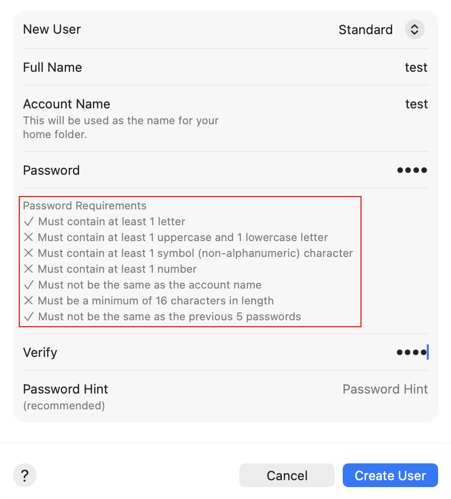
</div>
<figcaption>Password policy dialog showing the password requirements.</figcaption>
</figure>

## Disable Automatic Login and User List

###### Description

Listing users on the login screen MUST be disabled. This will lower the chances of guessing the correct logins.

###### Compliance Check & Implementation:

Check and modify the setting via the Settings GUI:

- *System Settings* → *Users & Groups*
  - Ensure that *Automatically log in as* is set to *Off*. This setting is by default set to *Off* and cannot be changed if FileVault is enabled as a login is required to unlock the disk.
- *System Settings* → *Lock Screen*
  - Set *Login window shows* to *Name and password*
  - Disable *Show the Sleep, Restart and Shut Down buttons*

The settings are also shown on the following <a href="#figure:automatic-login" data-reference-type="ref+label" data-reference="figure:automatic-login">4.2</a> and <a href="#figure:users-list" data-reference-type="ref+label" data-reference="figure:users-list">4.3</a>.

<figure id="figure:automatic-login">
<div id="figure:automatic-login">
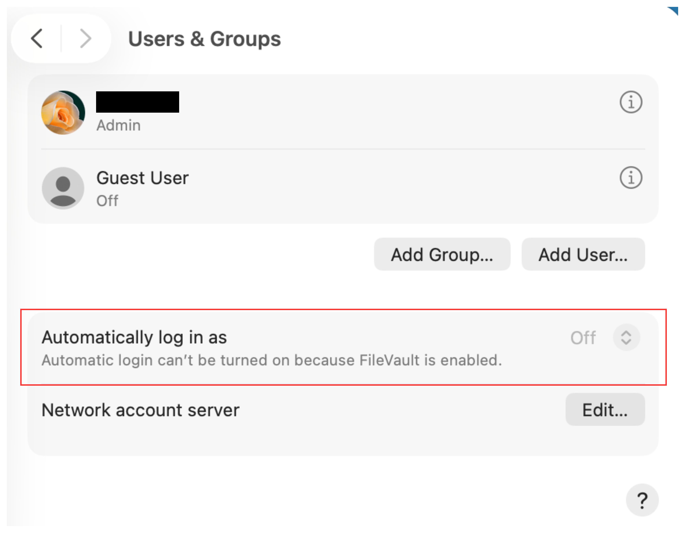
</div>
<figcaption>Disable Automatic Login.</figcaption>
</figure>

<figure id="figure:users-list">
<div id="figure:users-list">
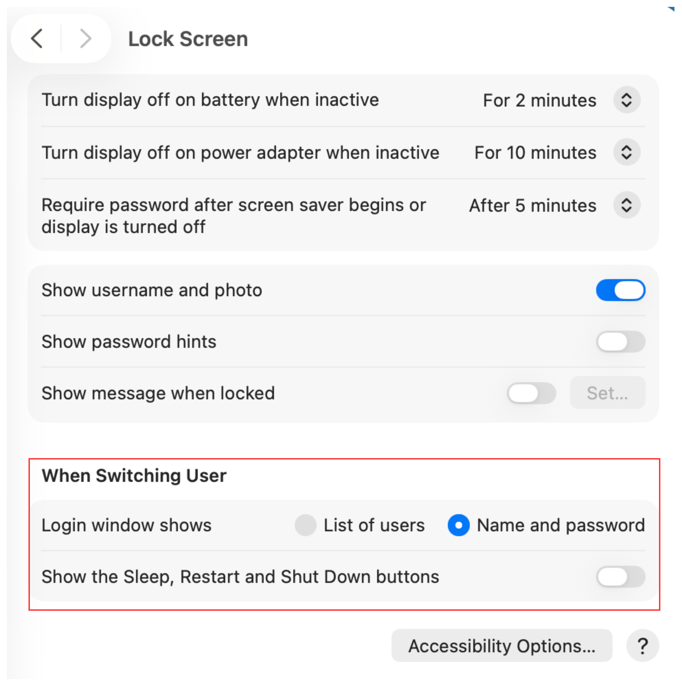
</div>
<figcaption>Disable User List and Password Hints.</figcaption>
</figure>

> **Note:** *This setting will only have a remarkable effect on Intel systems running macOS when Full Disk Encryption Auto-Login is disabled or when a user logs out, as FileVault auto-login will skip the second authentication prompt that is controlled with this setting. On macOS installations running on Apple Silicon hardware, this setting will work as desired and prompt for username and password on every boot.*

## Screensaver and Unlocking

###### Description

The screen MUST be locked automatically after a certain time of inactivity. After this, the password MUST be required to unlock the screen.

###### Compliance Check & Implementation:

Check and modify the setting via the Settings GUI:

- *System Settings* → *Lock Screen*
  - Adjust the time frame of *Turn display off on battery when inactive* and *Turn display off on power adapter when inactive* to your needs, but we recommend a maximum of *For 5 minutes*.
  - Set *Require password after screen saver begins or display is turned off* to *Immediately*.

<figure>
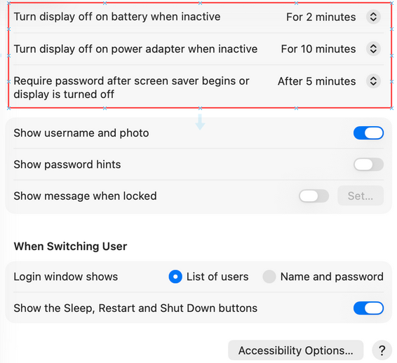
<figcaption>Show a screen saver when inactive and require the user’s password.</figcaption>
</figure>

## Disable Touch ID & Unlock with Apple Watch

###### Description

If your Mac or Magic Keyboard has Touch ID[^23], you can use it to unlock your Mac, authorize purchases from the iTunes Store, the App Store, and Apple Books, and make purchases on the web using Apple Pay. You can also use Touch ID to sign in to some third-party apps[^24]. Furthermore, macOS offers to terminate the session lock using a nearby Apple Watch.

###### Configure Touch ID

Touch ID MAY be enabled as an authentication mechanism for unlocking the Mac. If Touch ID is used, the Touch ID timeout MUST be adjusted to *30 minutes* (default is 2 days). After this period, macOS will require you to enter your user’s password to keep Touch ID enabled.

In some situations, you need to enter your password instead of using Touch ID:

- If you have just restarted your Mac
- If you have logged out of your user account
- If your fingerprint isn’t recognized five times in a row
- If you have not unlocked your Mac in more than 48 hours (you MUST adjust that to *30 minutes*)
- If you have just enrolled or deleted fingerprints

macOS comes with a command line utility named `bioutil`, a tool for viewing and changing Touch ID configuration and listing or deleting enrolled fingerprints.

You can review your current user’s Touch ID configuration by issuing the following command:

    > bioutil -r 
    User Touch ID configuration:
            Biometrics for unlock: 1
            Biometrics for ApplePay: 0
            Effective biometrics for unlock: 1
            Effective biometrics for ApplePay: 0
    Operation performed successfully.

Furthermore, you can review the system’s Touch ID configuration (applicable for all users):

    > bioutil -rs
    System Touch ID configuration:
            Biometrics functionality: 1
            Biometrics for unlock: 1
            Biometric timeout (in seconds): 172800
            Match timeout (in seconds): 14400
            Passcode input timeout (in seconds): 561600
    Operation performed successfully.

To be compliant with the maximum Touch ID timeout, change the setting system-wide:

    > sudo bioutil -w -s --btimeout 1800
    Password:
    Operation performed successfully.

To be compliant the following output MUST be present:

    > bioutil -rs                       
    System Touch ID configuration:
            Biometrics functionality: 1
            Biometrics for unlock: 1
            Biometric timeout (in seconds): 1800
            Match timeout (in seconds): 14400
            Passcode input timeout (in seconds): 561600
    Operation performed successfully.

###### Disable Unlock with Apple Watch

Apple Watches are not an approved authenticator, and their use MUST be disabled. Disabling Apple Watches is necessary to ensure that the information system retains a session lock until the user reestablishes access using authorized identification and authentication procedures.

The Apple Watch setting is only visible when the following conditions are met and by default disabled[^25]:

- Wi-Fi and Bluetooth are turned on
- The Mac and Apple Watch are signed in to iCloud with the same Apple ID
- The Apple ID uses two-factor authentication
- The Apple Watch uses a passcode

###### Compliance Check & Implementation:

Check and modify the setting via the Settings GUI:

- *System Settings* → *Touch ID & Password*
  - Ensure that only required Fingerprints are configured if you use Touch ID, otherwise there MUST NOT be any Fingerprints configured.
  - Review *Use Touch ID to unlock your Mac*. This MAY be enabled.
  - Disable *Use Touch ID for Apple Pay*
  - Disable *Use Touch ID for purchases in iTunes Store, App Store and Apple Books*
  - Disable *Use Touch ID for autofilling passwords*
  - Disable *Use Touch ID for fast user switching*
  - Disable unlocking your Mac using Apple Watches if there are any.

The settings are also shown on the following <a href="#figure:touch-id-config" data-reference-type="ref+label" data-reference="figure:touch-id-config">4.4</a>.

<figure id="figure:touch-id-config">
<div id="figure:touch-id-config">
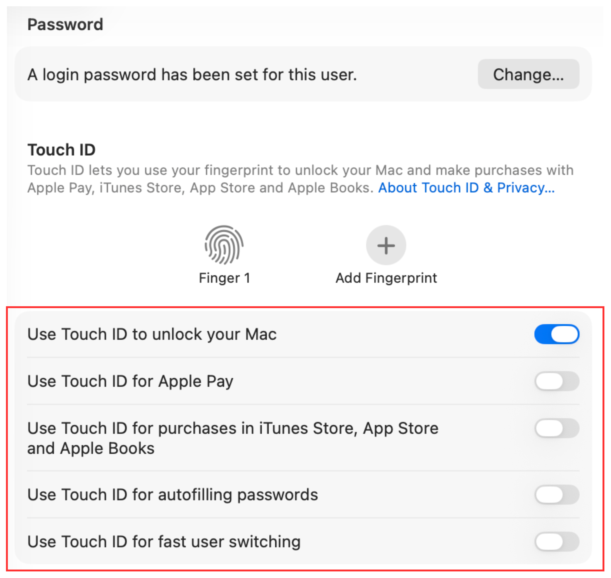
</div>
<figcaption>Disable Touch ID for use cases where it’s not needed.</figcaption>
</figure>

## Disable Guest Accounts

The guest account allows users access to the system without having to create an account or password.

### Disable the Guest Account

###### Description

Disabling the guest account mitigates the risk of an untrusted user doing basic reconnaissance and possibly using privilege escalation attacks to take control of the system. Therefore, every permission or functionality for guest accounts MUST be permanently disabled and the guest account MUST be disabled.

###### Compliance Check

Check and modify the setting via the Settings GUI:

- System Settings → *Users & Groups*
- Make sure the Guest User is disabled

This is also shown in the following <a href="#figure:disable-guest-user" data-reference-type="ref+label" data-reference="figure:disable-guest-user">4.5</a>.

<figure id="figure:disable-guest-user">
<div id="figure:disable-guest-user">
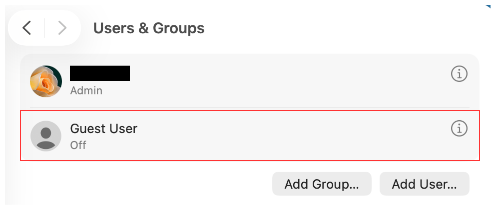
</div>
<figcaption>Disable the Guest Account.</figcaption>
</figure>

This can also be verified in the Terminal via:

    > defaults read /Library/Preferences/com.apple.loginwindow GuestEnabled
    0

###### Implementation

The setting can be modified by running:

    sudo defaults write /Library/Preferences/com.apple.loginwindow GuestEnabled -bool false

### Disable Guest Account Access to File Shares

###### Description

Turning off guest access prevents anonymous users from logging in and accessing files shared via SMB.

###### Compliance Check & Implementation:

Check and modify the setting via the Settings GUI as shown in <a href="#figure:guest-user-denied" data-reference-type="ref+label" data-reference="figure:guest-user-denied">4.6</a>:

- System Settings → *Users & Groups*
  - Click on the Guest user’s *(i)* Button
  - Check that *Allow guests to log in to this computer* is disabled
  - Check that *Allow guest users to connect to shared folders* is disabled

<figure id="figure:guest-user-denied">
<div id="figure:guest-user-denied">
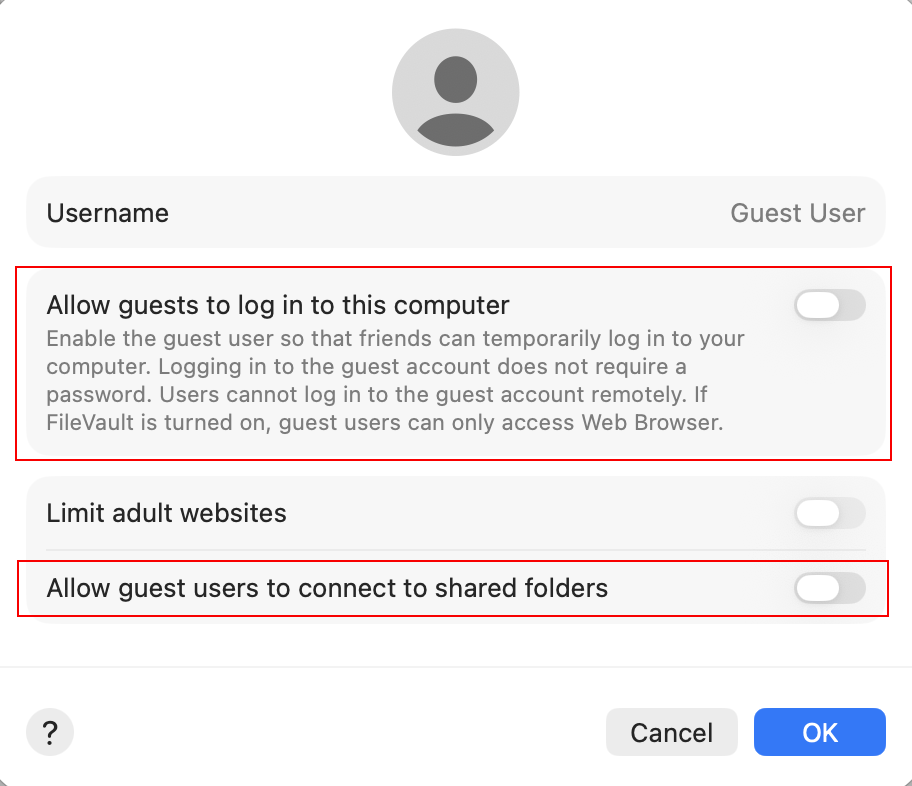
</div>
<figcaption>Disabled Guest User settings.</figcaption>
</figure>

## Restrict Sudoers File

###### Description

The following restriction ensures that the `sudo` command will prompt the administrator’s password every time a privileged command is executed, and that this authentication must be repeated for every new terminal session.

###### Compliance Check

To check for these mandatory values, use the following command:

    > sudo cat /etc/sudoers | grep -e "tty_tickets" -e "timestamp_timeout=0"
    Defaults timestamp_timeout=0
    Defaults tty_tickets

> **Note:** If the command returns no output, it means the settings are missing and the system is non-compliant. The settings must be visible in the output exactly as shown above.

###### Implementation

To restrict the grace period and limit it to individual TTYs, the settings MUST be added to the `/etc/sudoers` file.

Use the `visudo` command to safely edit the file as root. Add the following two lines, ideally near the other `Defaults` entries:

    > sudo visudo

Add the following lines:

    Defaults timestamp_timeout=0
    Defaults tty_tickets

> **Warning:** These changes may be reverted during major macOS upgrades. Therefore, the respective hardening MUST be checked again after upgrading.

## Automatically Lock the Login Keychain (Optional)

###### Description

In macOS, the login keychain is a secure storage area that stores various types of sensitive information such as passwords, encryption keys, and certificates. It is automatically created when a user account is set up on a Mac, and it is protected by the user’s login password.

Locking the login keychain is an important security measure for a couple of reasons:

- Prevent Unauthorized Access: When you lock the login keychain, it requires the user’s login password to unlock and access the stored information. This ensures that even if someone gains physical access to your Mac, they won’t be able to access the sensitive data stored in the keychain without your password.
- Protect Sensitive Information: The login keychain holds various types of sensitive information, including website passwords, Wi-Fi passwords, and secure notes. Locking the keychain helps safeguard this information from unauthorized access or potential misuse. It adds an extra layer of protection for your personal and confidential data.

By default, macOS automatically does not lock the login keychain after a certain period of inactivity, but when the computer goes to sleep. However, you can also manually lock the keychain at any time to ensure that your stored data remains secure.

It is recommended to check whether the login keychain can be locked.

###### Compliance Check & Implementation:

- Open *Keychain Access* and select the login Keychain
- Choose Edit → *Change Settings* for Keychain *Login*
- Optional: Set Lock after \[…\] minutes of inactivity to *15*
- Mandatory: Check *Lock when sleeping*

> **Note:** Locking the keychain automatically can impact the user experience. Since on every lock, daemons such as the Wi-Fi service requires unlocking the keychain via entering the user’s password again (unlocking the mac via Touch ID is not sufficient!). Hence, automatic nightly backups over Wi-Fi will be affected.

## Require Administrator Password

###### Description

An administrator password MUST be required to access system settings.

###### Compliance Check & Implementation:

Check and modify the setting via the Settings GUI as th following <a href="#figure:settings-admin-password" data-reference-type="ref+label" data-reference="figure:settings-admin-password">4.7</a> shows:

- *System Settings* → *Privacy & Security*

- Scroll down to *Advanced* and enable *Require an administrator password to access system-wide settings*

<figure id="figure:settings-admin-password">
<div id="figure:settings-admin-password">
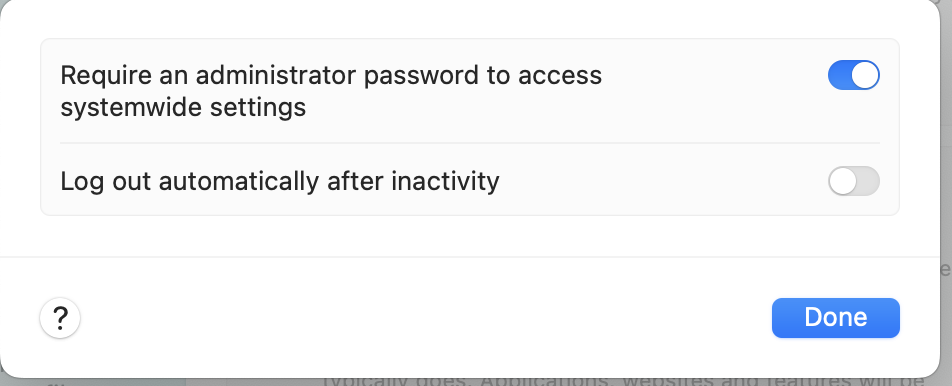
</div>
<figcaption>Enable <em>Require administrator password to access system-wide settings</em>.</figcaption>
</figure>

## Login Items

###### Description & Implementation:

Login Items MUST be reviewed frequently to control which applications are opened automatically upon startup.

- *System Settings* → *General* → *Login Items & Extensions*
- Disable all applications that are not required to start upon login of that user

<figure>
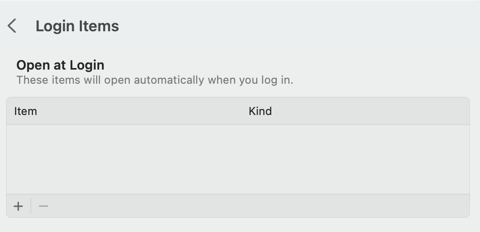
<figcaption>Startup items must be reviewed frequently.</figcaption>
</figure>

## macOS Password Manager & Keychain

This section handles using the macOS password and secret management capabilities. These settings may interfere with other corporate directives and guidelines. A password manager MUST be used for organizing and storing login credentials and secure notes.

###### Notes About macOS Keychain & Use of a Password Manager

The Keychain is a locked, encrypted container used to store account names and passwords for apps, servers, Wi-Fi and websites. You can also use keychains to store confidential information such as credit card numbers. In macOS, the system and login keychains serve different purposes and store different types of information. Here’s an overview of the differences between the two:

- **System Keychain:** The system keychain is a keychain that is accessible to all users of the Mac and is primarily used to store system-wide certificates and encryption keys. It contains security credentials required by the operating system and various system services, such as certificates for verifying software updates or secure network connections. The system keychain is managed by the system administrator and is not directly accessible or modifiable by individual users (without administrative permissions).
- **Login Keychain:** The login keychain is specific to each user account on a Mac and is automatically created for each user when they log in. It is designed to store the user’s personal passwords, such as Wi-Fi passwords, website login credentials, email account passwords, and other application-specific passwords. When a user logs in, their login keychain is automatically unlocked using their login password, and the stored passwords are made available to the user and various applications that request them.

The login keychain is NOT RECOMMENDED to be used as your day-to-day password manager in business use cases. For personal use cases using keychain may be fine as using any password manager may still be better than not using a password manager at all.

It MAY be used for necessary operating system-related or application-related use cases as applications will store their secrets with strict access controls in keychain (this cannot be avoided).

<div id="disable-keychain-icloud-sync">

###### Disable Keychain iCloud Sync

</div>

Keychain iCloud Sync MUST be disabled to prevent secrets from syncing between all Apple ID’s devices in business cases. For personal use, using iCloud Sync to synchronize secrets across devices MAY be used. Disabling this feature can be performed using a configuration profile key `allowCloudKeychainSync` in the domain `com.apple.applicationaccess`. This key is configured in <a href="#section:05-09-disable-icloud-services" data-reference-type="ref+label" data-reference="section:05-09-disable-icloud-services">7.7</a> with the provided configuration profile `ERNW_icloud_services.mobileconfig`.

Please note that this essentially disconnects the system from other devices using the same Apple-ID/Apple Account. Once you install these policies, you can *not* easily revert these settings.

###### TOTP on Different Devices

macOS 12 Monterey added the possibility of using the *Passwords* application as a generator for Time-based One-time Passwords (TOTP). To generate these TOTPs, respective TOTP secrets are added in the *Passwords* application.

When an additional device with TOTP generator capabilities is available, TOTPs MUST NOT be generated on the device authenticating to the service. Using different devices for 2FA adds an extra layer of security. If your primary device, such as your notebook, gets lost, stolen, or compromised, attackers will not have immediate access to your TOTP codes. They would need physical access to the secondary device (smartphone) as well.

## Passkeys and FIDO2 Hardening

###### Description

Passkeys are a modern, cryptographically secure replacement for passwords, based on the open FIDO2 standard (which includes the WebAuthn protocol). They rely on an asymmetric credential pair: a private key stored securely on the device and a public key registered with the service provider. While Passkeys are highly effective at mitigating phishing and credential theft, the synchronization of these private keys poses a data security and exfiltration risk, particularly in corporate environments.

By default, macOS attempts to synchronize Passkeys via iCloud Keychain to enable seamless access across all of a user’s logged-in Apple devices (iPhone, iPad, other Macs). For company devices, this synchronization MUST be restricted. Corporate Passkey credentials must remain secured solely on the managed device and MUST NOT be permitted to migrate to a user’s personal, unmanaged iCloud account or non-corporate devices. This control ensures the Non-Repudiation and Binding of corporate identity to the designated managed endpoint.

###### Disallow Synchronization of Credentials

On a standard macOS installation, iCloud Keychain sync is available to the user. There is no restriction profile installed by default. This can be verified via the GUI:

- Open *System Settings* → *\[User Name\]* (Apple ID) → *iCloud* → *Passwords*.
- Ensure *Sync this Mac* is *Off*.

<figure>
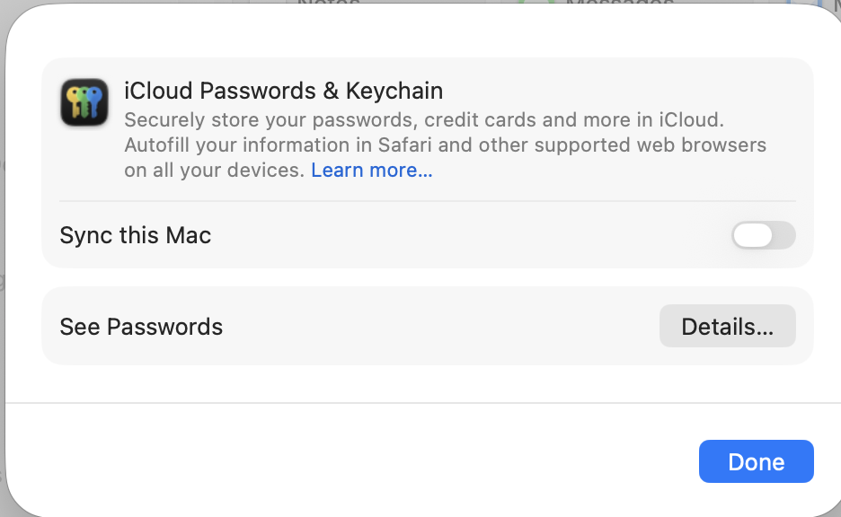
<figcaption>Keychain sync MUST be disbaled.</figcaption>
</figure>

###### Enforce Touch ID/Face ID for Passkey Use

To ensure that a malware script cannot use a stored Passkey without the user’s knowledge, the system MUST require “User Presence” (Biometrics) for every transaction.

The configuration file for this setting (`com.apple.security.FIDO2.plist`) does not exist on a fresh installation. This means the system relies on internal defaults, which may vary by OS version. To ensure consistent security, we explicitly enforce this setting.

###### Compliance Check

The following command checks for the explicit configuration:

    > defaults read com.apple.security.FIDO2 TouchIDRequired 2>/dev/null || echo "Setting not found"
    Setting not found

###### Implementation

If the result is `Setting not found`, the system is not compliant and the setting should be set with:

    defaults write com.apple.security.FIDO2 TouchIDRequired -bool true

## Touch ID for Sudo (Optional)

###### Description

The **Pluggable Authentication Modules (PAM)** system controls how users are authenticated for system services. It is possible to configure the system to allow Touch ID for the `sudo` command. This enables administrators to use their biometrics, secured by the Secure Enclave, to authorize privileged commands.

This guide discourages editing the `/etc/pam.d/sudo` directly because macOS may overwrite that file during system upgrades, resulting in removing the configuration. Modern macOS versions include a directive `auth include sudo_local` in the main configuration. The correct, safe way to enable Touch ID is to create and edit `/etc/pam.d/sudo_local`. This file persists across updates and separates custom configurations from system defaults. The PAM module MAY be changed to enable this feature.

###### Compliance Check

This check verifies that `pam_tid.so` is enabled in the local override file.

    > grep 'pam_tid.so' /etc/pam.d/sudo_local
    auth       sufficient     pam_tid.so

###### Verifying System Integrity

This check ensures that the main system configuration has not been tampered with and still requires the standard password fallback (`pam_opendirectory.so`) if Touch ID fails.

    > grep 'pam_opendirectory.so' /etc/pam.d/sudo
    auth       required       pam_opendirectory.so

###### Implementation

To safely enable Touch ID for sudo, copy the system-provided template to the active configuration path and enable the module.

    sudo cp /etc/pam.d/sudo_local.template /etc/pam.d/sudo_local

Open the file in a text editor (e.g., `sudo nano /etc/pam.d/sudo_local`) and uncomment the `pam_tid.so` line.

The changes take effect immediately.

# Updates & Time

This section covers the secure configuration of keeping macOS up-to-date.

## Operating System Updates

It is always recommended to have auto-updates enabled to automatically deliver the latest security and software patches to the system.

###### Ensure All Apple-provided Software Is Current

Software vendors release security patches and software updates for their products when security vulnerabilities are discovered. There is no simple way to complete this action without a network connection to an Apple software repository. Please ensure appropriate access for this control. This check is only for what Apple provides through software update. With macOS Ventura Apple introduced Rapid Security Responses (RSR)[^26]. *Rapid Security Responses are a new type of software release for iPhone, iPad, and Mac. They deliver important security improvements between software updates—for example, improvements to the Safari web browser, the WebKit framework stack, or other critical system libraries. They may also be used to mitigate some security issues more quickly, such as issues that might have been exploited or reported to exist “in the wild.”*[^27]

###### Compliance Check

It is possible to check the current system for updates through either the GUI in *System Settings* → *Software Update*, or issuing the following command on the command line:

    > softwareupdate -l
    No new software available.

When an OS update is available the response may look similar to the following:

    > softwareupdate -l
    Software Update Tool

    Finding available software
    Software Update found the following new or updated software:
    * Label: macOS Tahoe 26.1-25B78
            Title: macOS Tahoe 26.1, Version: 26.1, Size: 4579334KiB, Recommended: YES, Action: restart, 

Existing software updates MUST be installed.

Furthermore, the last time of updating macOS and its components should be queried:

    defaults read /Library/Preferences/com.apple.SoftwareUpdate LastFullSuccessfulDate

The returned timestamp should be within the last 7 days.

###### Implementation

Existing updates can be installed running:

    sudo softwareupdate -i -a -R

After installing all updates, the command should return `No new software available.`.

###### Enable Automatic Updates

Go to *System Settings* → *General* → *Software Update* and Turn On *Automatic Updates* and klick on the Info button for enabling the settings.

<figure id="figure:auto-update-enabled">
<div id="figure:auto-update-enabled">
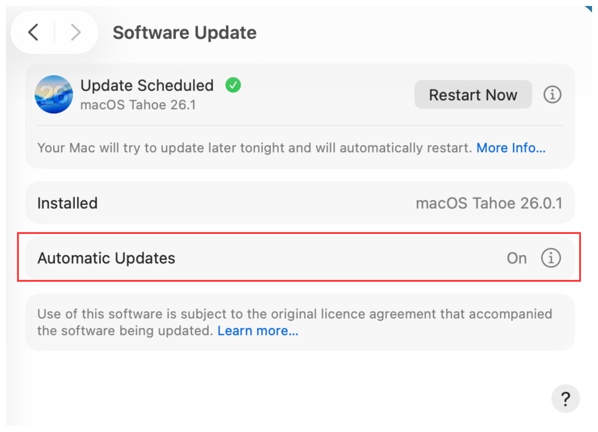
</div>
<figcaption>Enabling Automatic Updates (Overview).</figcaption>
</figure>

- *Download new updates when evailable*
- *Install macOS updates*
- *Install system data and security updates*

<figure id="figure:auto-update-enabled-details">
<div id="figure:auto-update-enabled-details">
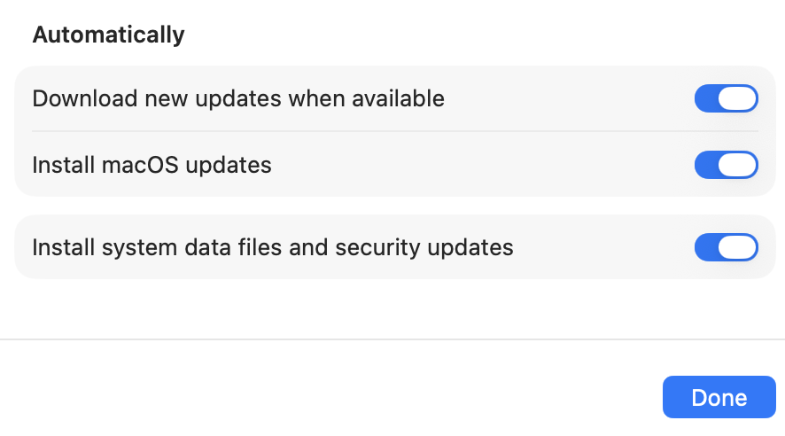
</div>
<figcaption>Enabling Automatic Updates (Options).</figcaption>
</figure>

###### Compliance Check

The following keys MUST return `1`.

    defaults read /Library/Preferences/com.apple.SoftwareUpdate AutomaticCheckEnabled
    defaults read /Library/Preferences/com.apple.SoftwareUpdate AutomaticDownload
    defaults read /Library/Preferences/com.apple.SoftwareUpdate AutomaticallyInstallMacOSUpdates
    defaults read /Library/Preferences/com.apple.commerce.plist AutoUpdate
    defaults read /Library/Preferences/com.apple.SoftwareUpdate CriticalUpdateInstall
    defaults read /Library/Preferences/com.apple.SoftwareUpdate ConfigDataInstall

###### Manual Implementation (Alternative):

If one of the previous settings is not present or returns `0`, it can be manually set by running the respective command from the following list:

    sudo defaults write /Library/Preferences/com.apple.SoftwareUpdate AutomaticCheckEnabled -int 1
    sudo defaults write /Library/Preferences/com.apple.SoftwareUpdate AutomaticDownload -int 1
    sudo defaults write /Library/Preferences/com.apple.SoftwareUpdate AutomaticallyInstallMacOSUpdates -int 1
    sudo defaults write /Library/Preferences/com.apple.commerce.plist AutoUpdate -int 1
    sudo defaults write /Library/Preferences/com.apple.SoftwareUpdate CriticalUpdateInstall -int 1
    sudo defaults write /Library/Preferences/com.apple.SoftwareUpdate ConfigDataInstall -int 1

###### Modify Update Frequency

It is recommended to check for updates daily. The default is to check for updates once a week.

###### Compliance Check

The setting can be reviewed via:

    > defaults read /Library/Preferences/com.apple.SoftwareUpdate.plist ScheduleFrequency
    1

> **Note:** By default, the key does not exist, so it will throw an error the first time.

###### Implementation

The following command changes the setting to check for updates daily:

    sudo defaults write /Library/Preferences/com.apple.SoftwareUpdate.plist ScheduleFrequency -int 1

## Enable Network Time Synchronization via NTP

###### Description

Network Time Protocol (NTP) is a protocol used to synchronize the clocks of computers and network devices over a network. While NTP is primarily used for accurate timekeeping and synchronization, it also plays a crucial role in maintaining security. Here are some reasons why network time synchronization via NTP is required from a security perspective:

- Secure Communication: Many security protocols and mechanisms rely on accurate time synchronization to establish secure communication. For example, Transport Layer Security (TLS) and Secure Shell (SSH) protocols use timestamps to verify the validity of digital certificates and prevent replay attacks. Accurate time synchronization provided by NTP ensures that these security protocols function correctly.
- Log Integrity and Forensics: Accurate timestamps are vital for maintaining the integrity of system logs and audit trails. Security logs are used to monitor and detect security incidents, and they rely on accurate time information to correlate events and identify potential threats. In the event of a security breach, accurate time synchronization facilitates forensic analysis and helps in determining the sequence of events.
- Authentication and Authorization: Time synchronization is essential for various authentication mechanisms that rely on time-based tokens or One-Time Passwords (OTPs). Systems that use time-based authentication, such as Time-Based One-Time Password (TOTP) algorithms, require synchronized clocks between the authentication server and the client device to generate and validate OTPs accurately.
- Certificate Validity: Digital certificates used in secure communication, such as SSL/TLS certificates, have specific validity periods. NTP synchronization ensures that the system’s clock accurately reflects the current time, preventing issues where certificates may be deemed invalid due to time discrepancies.

By ensuring accurate time synchronization across network devices and systems, NTP helps maintain the integrity, security, and reliability of various security mechanisms and protocols.

###### Compliance Check

The NTP settings can be reviewed via:

    > sudo systemsetup -getnetworktimeserver
    Network Time Server: time.euro.apple.com
    > sudo systemsetup -getusingnetworktime
    Network Time: On

###### Implementation

To ensure that your clock is always correct and not corrupt (e.g., necessary for log files), use the following commands:

    sudo systemsetup -setnetworktimeserver "time.euro.apple.com"
    sudo systemsetup -setusingnetworktime on 

You can also set the values via the Settings GUI as shown in <a href="#figure:ntp" data-reference-type="ref+label" data-reference="figure:ntp">5.3</a>.

- *System Settings* → *General* → *Date & Time*
- Enable *Set time and date automatically*
- Source `time.euro.apple.com` (the default one) or your corporate timeserver if not already present

<figure id="figure:ntp">
<div id="figure:ntp">
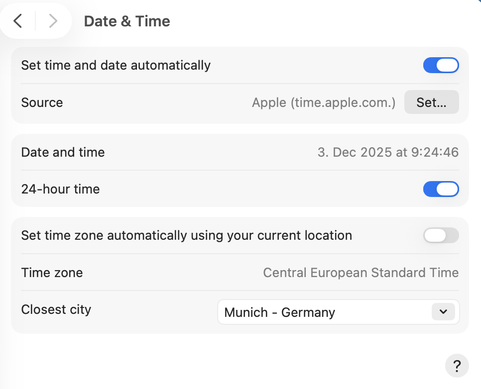
</div>
<figcaption>Enable date and time synchronization.</figcaption>
</figure>

# Secure Storage of Data & Backups

This section covers the secure storage of data with FileVault, managing secrets such as SSH keys with the Secure Enclave, creating backups with Time Machine, and more.

## Time Machine Backups

This section handles creating automatic backups using the macOS built-in backup feature *Time Machine*.

Time Machine automatically makes hourly backups for the past 24 hours, daily backups for the past month, and weekly backups for all previous months. The oldest backups are deleted when your backup disk is full. The first backup might take a long time, but you can continue using your Mac while a backup is underway. Time Machine backs up only the files that changed since the previous backup so that future backups will be faster.[^28]

In business use cases, network connected drives MAY be allowed to create backups if they are company-owned. In most cases creating backups of company devices on private network shares MUST NOT be performed. In cases where no company-owned network shares are present, company-owned external drives MUST ONLY BE used. For personal devices those restricitions do of course not apply. The following settings assume this guide is being used to harden a company-owned macOS client.

###### Enable Time Machine for Local Devices

It is possible to check whether Time Machine is configured by querying the backup destinations. If Time Machine is not enabled, the command `tmutil destinationinfo` will return `tmutil: No destinations configured.` as shown below:

    > tmutil destinationinfo 
    tmutil: No destinations configured.

Furthermore, the command output allows to differentiate between external drives and network drives as backup destinations. The following output shows the mount point being a monuted drive which indicates that this is a connected external drive as backup destination as the `Kind` property yields:

    > tmutil destinationinfo       
    ====================================================
    Name          : Backup_Drive
    Kind          : Local
    Mount Point   : /Volumes/Backup_Drive
    ID            : 12345678-E876-4242-92A3-41DAF53EFE4E

Whereas the following output shows the mount point being an `afp://` scheme URL which indicates that this is a network drive as backup destination as the `Kind` property yields:

    > tmutil destinationinfo
    ====================================================
    Name          : backup-mac
    Kind          : Network
    URL           : afp://ernw@storage._afpovertcp._tcp.local./backup
    ID            : 12345678-E7BA-4DAE-8D41-9D3D60841B64

In accordance company security policies non-company-owned network connected drives MUST NOT be used. Instead, only company-owned external drives MUST be used.

###### Encrypt Local Backups

Backups on external storage drives MUST be encrypted. The following screenshots show how to enable encrypted Time Machine backups on external storage.

###### Compliance Check & Implementation:

- Navigate to *System Settings* → *General* → *Time Machine*. Click on *+*.
- Select the device and enable *Encrypt backups*. Then click on *Set Up Disk…*.
- Set an adequate complex Password, that MUST fulfill the following requirements:
  - MUST have a minimum password length of at least 32 characters
  - Password MUST consist of at least one character of each character group (letters, numbers, special chars)
  - MUST NOT contain any default passwords
  - MUST consist of at least six different characters

### Disable Automatic Prompt

The automatic popups for using external drives as *Time Machine* drives MUST be disabled.

###### Compliance Check

    > defaults read com.apple.TimeMachine DoNotOfferNewDisksForBackup
    0

The setting is disabled when the key does not exist, or its value is set to `0`.

###### Implementation

    defaults write com.apple.TimeMachine DoNotOfferNewDisksForBackup -bool true

## Finder: Show All File Extensions

It is recommended to turn on displaying filename extensions to be always clear what sort of file you are processing.

###### Compliance Check

To check whether the setting is applied, run:

    > defaults read NSGlobalDomain AppleShowAllExtensions
    1

When the key does not exist, or the value is set to `0` this setting is disabled.

###### Implementation

- Open Finder → Settings → Advanced
- Set *Show all filename extensions*

<figure>
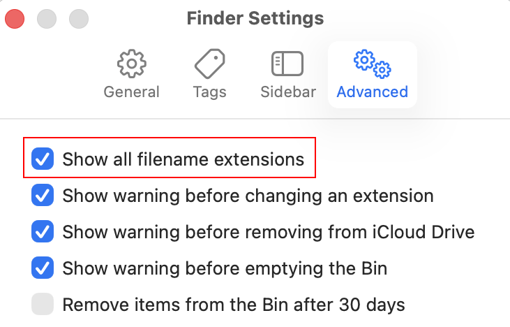
<figcaption>Enable show all filename extensions in Finder.</figcaption>
</figure>

To enable via the command line, run:

    defaults write NSGlobalDomain AppleShowAllExtensions -bool true

## Disable Creation of Metadata Files

It is recommended to prohibit macOS from creating temporary files on remote volumes such as network or USB storage. The following commands will prevent this behavior:

###### Compliance Check

The settings can be reviewed with:

    > defaults read com.apple.desktopservices DSDontWriteNetworkStores
    1
    > defaults read com.apple.desktopservices DSDontWriteUSBStores
    1

###### Implementation

    defaults write com.apple.desktopservices DSDontWriteNetworkStores -bool true
    defaults write com.apple.desktopservices DSDontWriteUSBStores -bool true

## Setuid and Setgid

Altering the *setuid* bits of binaries can be an essential step. This may affect or break functionality on these binaries, but you can always reverse these Steps. For example, use the following command to get a list of all *setuid* binaries:

    > sudo find / -perm -04000 -ls 2>/dev/null
    Password:
    1152921500312560517      168 -r-sr-xr-x    1 root             wheel              241264 Oct 29 02:21 /usr/bin/top
    1152921500312559206       64 -r-sr-xr-x    2 root             wheel              170816 Oct 29 02:21 /usr/bin/atq
    1152921500312559382       72 -rwsr-xr-x    1 root             wheel              171136 Oct 29 02:21 /usr/bin/crontab
    1152921500312559208       64 -r-sr-xr-x    1 root             wheel              170816 Oct 29 02:21 /usr/bin/atrm
    1152921500312560017       32 -r-sr-xr-x    1 root             wheel              102576 Oct 29 02:21 /usr/bin/newgrp
    1152921500312560419       48 -rwsr-xr-x    1 root             wheel              121904 Oct 29 02:21 /usr/bin/su
    1152921500312559206       64 -r-sr-xr-x    2 root             wheel              170816 Oct 29 02:21 /usr/bin/batch
    [...]
    1152921500312095477     2008 -rwsr-xr-x    1 root             wheel             2116624 Oct 29 02:21 /System/Library/CoreServices/RemoteManagement/ARDAgent.app/Contents/MacOS/ARDAgent
    1152921500312095477     2008 -rwsr-xr-x    1 root             wheel             2116624 Oct 29 02:21 /System/Volumes/Data/System/Library/CoreServices/RemoteManagement/ARDAgent.app/Contents/MacOS/ARDAgent

For example, use the following command to get a list of all *setgid* binaries:

    > sudo find / -perm -02000 -ls 2>/dev/null
    Password:
    1152921500312560670       32 -r-xr-sr-x    1 root             tty                119184 Oct 29 02:21 /usr/bin/write
    1152921500312563682      512 -rwxr-sr-x    1 root             _postdrop          568832 Oct 29 02:21 /usr/sbin/postqueue
    1152921500312563668      512 -rwxr-sr-x    1 root             _postdrop          569008 Oct 29 02:21 /usr/sbin/postdrop

Filter out Applications where you suspect *Bad code quality*, or you generally do not trust (e.g., the peripheral device driver of your mouse). The following commands unset the described permissions on files and directories:

    chmod u-s <file>
    chmod g-s <file>

This review MUST be performed frequently (e.g., once a month).

## Set Strict Global Umask (Optional)

The strict global `umask` defaults the permission of any file or directory that a user creates in the future[^29]. You can adjust the global `umask` with the following command:

    sudo launchctl config system umask 027

> **Note:** *This might break the installation of additional software that relies on a less restricted `umask`.*

# Network Communication Hardening & Privacy

The hardening measures discussed in this section aim to harden external interfaces and services, limit unnecessary communications to third parties such as software vendors and unnecessary disclosures of sensitive information.

## Enable macOS Firewall

macOS utilizes a layered firewall approach:

- **Application Firewall (ALF):** Controls connections on a per-application basis.
- **Packet Filter (PF) \[optional\]:** A lower-level, OpenBSD-derived packet filter that controls traffic at the network layer (IP/Port).

###### Application Firewall

The macOS Application Firewall MUST be enabled. It ensures that only authorized applications can accept incoming network connections. Additionally, “Stealth Mode” should be enabled to prevent the system from responding to uninvited probing requests (e.g., ICMP Echo).

Recommended configuration:

- *System Settings* → *Network* → *Firewall*
- Switch on the Firewall
- Click on *Options…*
- Unset *Automatically allow built-in software to receive incoming connections*
- Unset *Automatically allow downloaded signed software to receive incoming connections*
- Set *Enable stealth mode*
- Unset *Block all incoming connections* (Blocking all connections prevents legitimate services; use only if complete isolation is required).

Apple[^30] states regarding those settings:

- Selecting the option to *Block all incoming connections* prevents all sharing services, such as File Sharing and Screen Sharing, from receiving incoming connections.
- Enabling stealth mode prevents the computer from responding to probing requests. However, the computer still answers incoming requests for authorized apps. Unexpected requests are ignored.

For more details about the single settings, consult the previously linked Apple web page.

<figure>
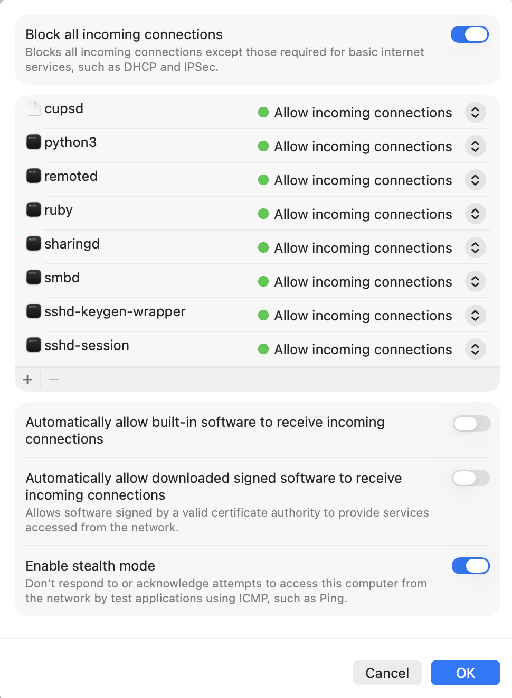
<figcaption>Setting the recommended Firewall Options.</figcaption>
</figure>

###### Compliance Check

To check the settings via the command line, run the following commands. The output below illustrates a compliant state where the firewall is active, stealth mode is on, and automatic allow-listing is disabled.

    > /usr/libexec/ApplicationFirewall/socketfilterfw --getglobalstate
    Firewall is enabled. (State = 1)

    > /usr/libexec/ApplicationFirewall/socketfilterfw --getstealthmode
    Stealth mode enabled

    > /usr/libexec/ApplicationFirewall/socketfilterfw --getblockall
    Firewall has block all state set to disabled.

    > /usr/libexec/ApplicationFirewall/socketfilterfw --getallowsigned
    Automatically allow built-in signed software DISABLED.
    Automatically allow downloaded signed software DISABLED.

The output indicates that the firewall is enforcing rules strictly (`DISABLED` for auto-allow) and is visible only to authorized traffic (`Stealth mode enabled`).

###### Implementation

The settings can be configured via the command line with the following commands:

    sudo /usr/libexec/ApplicationFirewall/socketfilterfw --setglobalstate on
    sudo /usr/libexec/ApplicationFirewall/socketfilterfw --setstealthmode on
    sudo /usr/libexec/ApplicationFirewall/socketfilterfw --setblockall off
    sudo /usr/libexec/ApplicationFirewall/socketfilterfw --setallowsigned off
    sudo /usr/libexec/ApplicationFirewall/socketfilterfw --setallowsignedapp off

### Packet Filter (Optional)

The Packet Filter (`pf`) is a powerful tool operating at the kernel level. Unlike the Application Firewall, which filters based on applications, `pf` filters based on network parameters such as IP addresses, ports, and protocols. It is controlled via the `/etc/pf.conf` configuration file and can be used to implement granular network policies.

###### Compliance Check

To verify that the Packet Filter engine is active:

    > sudo pfctl -s info | grep Status
    Status: Enabled for 0 days 01:22:15           Debug: Urgent

###### Implementation

To enable `pf` manually (transiently):

    sudo pfctl -e

To load specific Enterprise rules (e.g., blocking Telnet/RPC as per policy):

    sudo pfctl -f </path/to/config/file>

## Disable Power Nap and Network Wake

Power Nap and Wake-on-Network Access MUST be disabled.

###### Description

Power Nap allows macOS to perform background actions while the device is sleeping, such as checking Mail, updating Calendar events, and synchronizing other iCloud data. When plugged into power, it can even download software updates and perform Time Machine backups[^31].

From a security hardening perspective, the system MUST NOT be allowed to perform network-dependent activities or wake up remotely when it is supposed to be dormant. Disabling these features minimizes the device’s availability to potential attackers and prevents unnecessary network probes or data leakage during sleep cycles.

###### Compliance Check

Compliance requires checking both the low-level Wake-on-Magic-Packet setting (`womp`) and the high-level network access setting (`systemsetup`).

Wake-on-LAN (Low-Level Check)

This command verifies the state of “Wake on Magic Packet” (`womp`), which controls the core Wake-on-LAN functionality. The return value MUST be `0` (disabled).

    > pmset -g custom |awk '/womp/ { sum+=$2 } END {print sum}'
    0

Wake for Network Access (High-Level Check)

This command verifies the system configuration for “Wake for network access,” which controls Power Nap behavior related to network activity. The return value MUST indicate `Off`.

    > sudo systemsetup getwakeonnetworkaccess
    Wake On Network Access: Off

###### Implementation

To deactivate both Power Nap and all Wake-on-Network functions, use the Command Line Interface (CLI) or adjust the graphical settings.

Via Command Line (Recommended):

    sudo pmset -a womp 0 # Disables Wake on Magic Packet
    sudo systemsetup -setwakeonnetworkaccess off

Via Settings GUI:

To modify the settings, open System Settings and go to:

- *Battery* → *Options…*
- Set *Wake for network access* to *Never*

<figure>
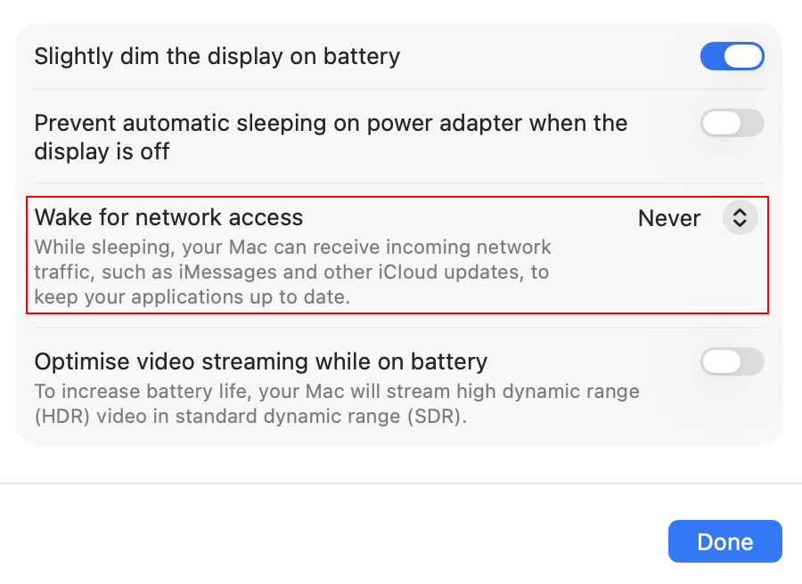
<figcaption>Disable Power Nap.</figcaption>
</figure>

After this, the previous command MUST return `0`.

## Disable Handoff & Universal Control

Handoff and Universal Control are integral components of Apple’s Continuity ecosystem, designed to enhance user convenience across multiple devices; however, their reliance on constant, proximate wireless communication and iCloud synchronization introduces potential risks to data separation and wireless privacy which MUST be mitigated on managed enterprise endpoints.

### Disable Handoff

Handoff is a feature to keep your workspaces in sync, but it does require sending data to Apple, which MUST be disabled.

- System Settings → General → AirDrop & Handoff
- Uncheck *Allow Handoff between this Mac and your iCloud devices*

<figure>
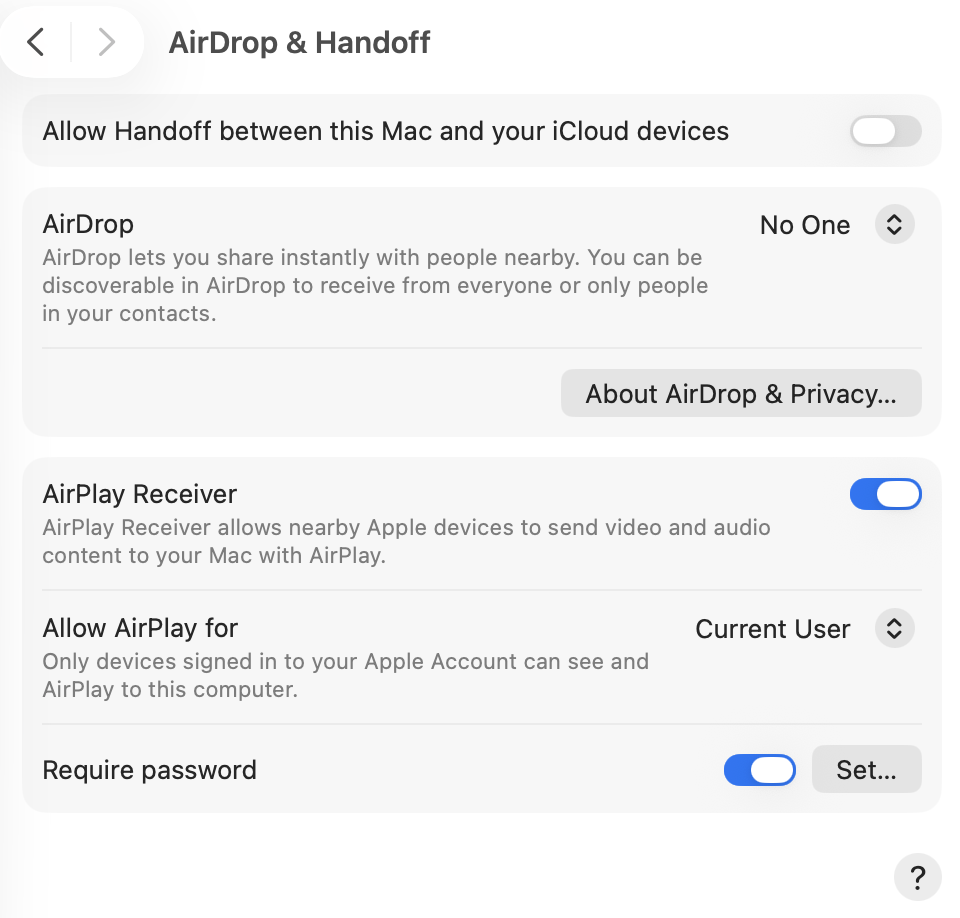
<figcaption>Disable Handoff.</figcaption>
</figure>

###### Compliance Check

The following two commands check whether handoff is enabled.

    > defaults -currentHost read com.apple.coreservices.useractivityd ActivityAdvertisingAllowed
    0
    > defaults -currentHost read com.apple.coreservices.useractivityd ActivityReceivingAllowed
    0

If not set up, these commands will give you an error.

###### Implementation

The settings can also be turned off with the following commands:

    defaults -currentHost write com.apple.coreservices.useractivityd ActivityAdvertisingAllowed -bool false
    defaults -currentHost write com.apple.coreservices.useractivityd ActivityReceivingAllowed -bool false

### Disable Universal Control

Universal Control is an intended remote control feature by devices nearby having logged in with the same Apple ID such as iPads and Macs. Universal Control streamlines multi-device workspaces by allowing you to use the same peripherals across multiple Macs and iPads. With Universal Control, you can use your main Mac’s trackpad and keyboard to control additional Macs and/or iPads nearby, so you don’t need a desk cluttered up with more than one set of input devices. As data MUST NOT be shared between devices with the same Apple ID without intention and communication over controlled and compliance-approved channels, Universal Control MUST be disabled. Universal control only works when Handoff is enabled, therefore it MUST be ensured that Handoff is disabled. Furthermore, it is recommended to disable Bluetooth as long as it is not used.

- System Settings → Displays
- Click on *Advanced…*
- Disable everything in section *Link to Mac or iPad*

<figure>
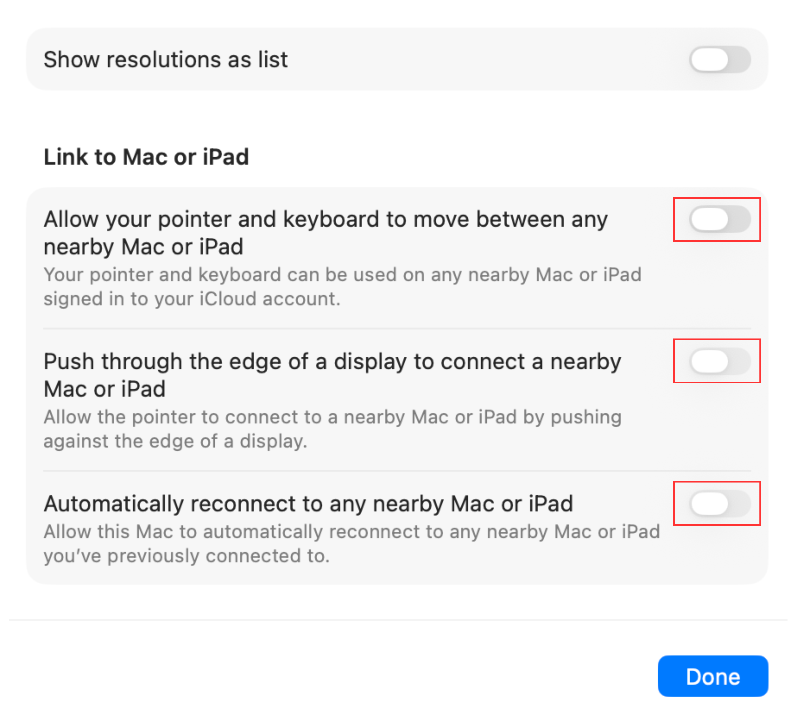
<figcaption>Disable Universal Control.</figcaption>
</figure>

## Change Computer-/Hostname

###### Description

It is recommended to mask the host’s name not to contain personal information.

###### Implementation

The following two commands can be used to change the values:

    sudo scutil --set ComputerName <name>
    sudo scutil --set LocalHostName <name>

###### Compliance Check

Review the settings by running:

    scutil --get ComputerName
    scutil --get LocalHostName

The settings can also be reviewed and changed via the Preferences App.

- System Settings → General → Sharing
  - Change *Local Hostname* by clicking on *Edit…*
- System Settings → General → About
  - Click on the text in the *Name* field.

<figure>
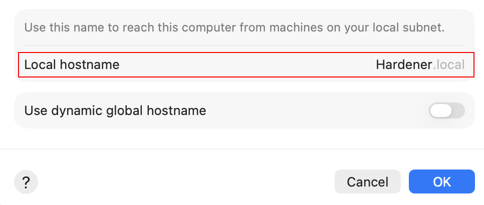
<figcaption>Changing the Computer Name.</figcaption>
</figure>

<figure>
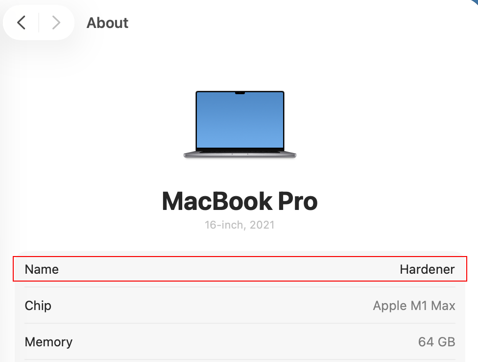
<figcaption>Changing the Local Host Name.</figcaption>
</figure>

## Disable AirDrop

###### Description

AirDrop MUST be disabled to prevent unauthorized file transfers from potentially untrusted devices. There are two options to disable AirDrop, either temporarily or persistently.

###### Compliance Check

The following command can be used to review whether the Airdrop deamon has been disabled via the persistent method.

    > defaults read com.apple.NetworkBrowser DisableAirDrop
    1

###### Implementation Disable AirDrop Temporarily in Finder:

Temporarily disabling AirDrop is possible via Finder by limiting its access to *no one*. To disable and restrict AirDrop, perform the following steps:

- Open Finder and navigate to the *AirDop* menu in the sidebar.
- Click on *Allow me to be discovered by:*
- Select *No One* from the dropdown menu.

<figure>

<figcaption>In Finder, set AirDrop visibility to None.</figcaption>
</figure>

Now, the Mac should not be visible in the AirDrop menu of other devices nearby. Further, it is recommended to disable Bluetooth.

###### Implementation Disable the AirDrop Daemon:

A persistent way of disabling AirDrop is to disable the respective functionality via:

    defaults write com.apple.NetworkBrowser DisableAirDrop -bool true

This will cause AirDrop to be grayed out in the control center, as the following screenshot shows.

<figure>
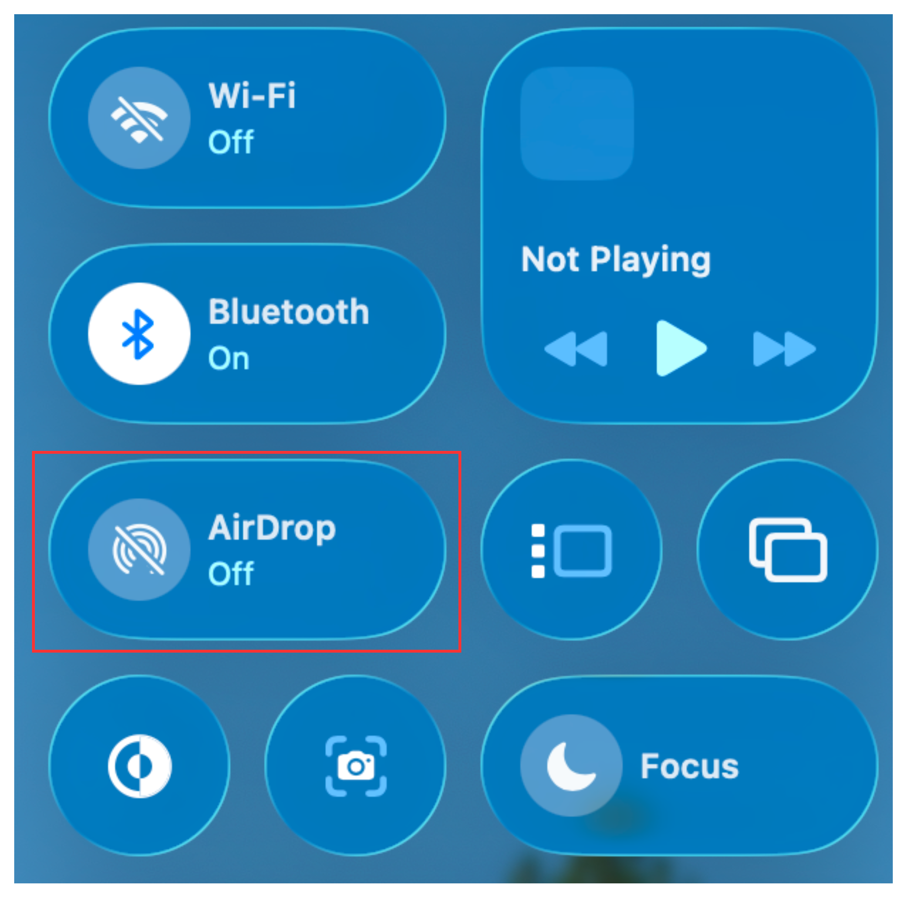
<figcaption>AirDrop being grayed out in control center.</figcaption>
</figure>

AirDrop will still be usable if not set to be discovered by *No One*. The setting takes effect after logging out and logging in again. Then, the AirDrop menus in Finder are also hidden.

The AirDrop daemon is RECOMMENDED to be disabled. It MAY be re-enabled temporarily when needed. To re-enable AirDrop temporarily, you can run the following command and logout and login again:

    defaults write com.apple.NetworkBrowser DisableAirDrop -bool false

> **Note:** *This adjustment is necessary for every macOS user.*

## Disable Network Services & Sharing

This section handles the macOS sharing functionality. Sharing is disabled by default. In the *System Settings*’ Sharing menu (→ *General* → *Sharing*), everything MUST be disabled as shown in <a href="#figure:sharing" data-reference-type="ref+label" data-reference="figure:sharing">7.1</a>.

<figure id="figure:sharing">
<div id="figure:sharing">
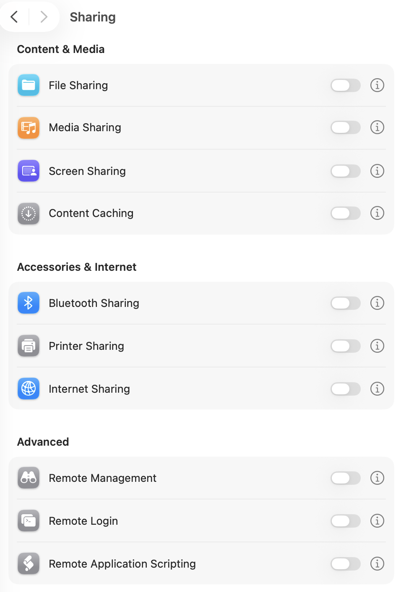
</div>
<figcaption>Disable all sharing functionality.</figcaption>
</figure>

After the following fixes using `launchctl`, the processes will still be running in the background until your machine is rebooted, the process is (manually) killed, or the process exits on its own. Therefore, checking for compliance after the implementation step will only work correctly after a reboot.

###### Disable Screen Sharing

Screen Sharing provides a virtual remote desktop connection to the macOS user interface, which can be enabled via the Sharing settings. This service MUST be disabled to minimize the network attack surface and prevent unauthorized remote graphical access to the system, especially outside of managed support sessions.

###### Compliance Check

    > sudo launchctl list | grep -c com.apple.screensharing
    0

###### Implementation

    sudo launchctl disable system/com.apple.screensharing

###### Disable File Sharing

Server Message Block (SMB) file-sharing MUST be disabled (default).

###### Compliance Check

    > launchctl print-disabled system |grep -c '"com.apple.smbd" => disabled'
    1

> **Note**: The setting is also compliant if `smbd` is not referenced in the file.

###### Implementation

Otherwise, it can be disabled via:

    sudo launchctl disable system/com.apple.smbd

###### Disable Printer Sharing

Printer sharing, controlled by the Common Unix Printing System (CUPS), allows the local machine to act as a print server, sharing its locally connected printers with other network clients. This service SHOULD be disabled unless the machine has a specific business requirement to serve print queues, as it adds an unnecessary network listener.

###### Compliance Check

    > sudo cupsctl | grep "_share_printers" 
    _share_printers=0

###### Implementation

    sudo cupsctl --no-share-printers

###### Disable Remote Login

Remote Login (SSH) enables remote command-line access to the Mac. Although SSH is a secure protocol, having the SSH server enabled on client machines exposes a common attack vector (Port 22) to the network. Therefore, Remote Login MUST be disabled unless explicitly required for administrative or developer access.

###### Compliance Check

    > sudo systemsetup -getremotelogin
    Remote Login: Off

###### Implementation

    sudo systemsetup -setremotelogin off

###### Disable Remote Management

Remote Management relies on the Apple Remote Desktop (ARD) agent to allow powerful remote control and administration features, such as remote file transfers, script execution, and detailed system reporting. This service is a high-privilege listening agent and MUST be deactivated to prevent unauthorized deep system access.

###### Compliance Check

The following command should return nothing:

    sudo ps -ef |grep -e ARDAgent |grep -v grep

###### Implementation

    sudo /System/Library/CoreServices/RemoteManagement/ARDAgent.app/Contents/Resources/kickstart -deactivate -stop                                      

###### Disable Remote AppleEvents

Remote AppleEvents is a service that allows one Mac to send commands and scripts to applications running on another Mac over the network. This powerful remote execution capability MUST be disabled to prevent unauthorized lateral movement, remote control of running applications, or execution of malicious scripts. The service is managed by the underlying `com.apple.AEServer` daemon.

###### Description

It is recommended to disable (default) the Remote AppleEvent service. This service can perform operations on software over the network to another Mac. Hence, it SHOULD always be disabled. The following commands check whether Remote AppleEvents and its respective service is enabled or not:

###### Compliance Check

    > sudo systemsetup -getremoteappleevents
    Remote Apple Events: Off
    > launchctl print-disabled system |grep com.apple.AEServer
    "com.apple.AEServer" => disabled

###### Implementation

If it is enabled or returns empty output, the following commands will disable it:

    sudo systemsetup -setremoteappleevents off
    sudo launchctl disable system/com.apple.AEServer

> **Note:** *Turning Remote AppleEvents on or off requires Full Disk Access privileges.*

###### Disable Content Caching

Content caching MUST be disabled. Content caching is a macOS service that helps reduce Internet data usage and speed up software installation on Mac computers[^32]. It is not recommended for corporate devices to act as a caching server.

###### Compliance Check

    > defaults read /Library/Preferences/com.apple.AssetCache.plist |grep Activated
    Activated = 0;
    > AssetCacheManagerUtil isActivated
    2023-06-06 21:08:28.577 AssetCacheManagerUtil[23370:350329] Content caching is deactivated: (no error)

###### Implementation

Issue the following command (may return an error if already deactivated) to disable content caching:

    sudo AssetCacheManagerUtil deactivate

###### Disable Media Sharing

Media Sharing (or Home Sharing) allows the local user to share their media libraries (Music, TV, Photos) over the network, making the content streamable by other authorized devices (e.g., Apple TV, other Macs). This service SHOULD be disabled to prevent the machine from exposing media libraries over the network via protocols like Home Sharing or Open Directory Service Agent (ODSAgent), thus protecting personal data integrity.

###### Compliance Check

    > sudo launchctl list | grep -c com.apple.ODSAgent
    0
    > defaults read com.apple.amp.mediasharingd home-sharing-enabled
    0

###### Implementation

    sudo launchctl disable system/com.apple.ODSAgent
    sudo defaults write com.apple.amp.mediasharingd home-sharing-enabled -int 0

###### Legacy & Services

To minimize the attack surface, services that are not required for standard client operations MUST be disabled. macOS includes several system daemons for legacy protocols or server functionalities that are typically unnecessary for end-user devices.

The following services MUST be disabled:

| Service | Identifier | Description |
|---|---|---|
| TFTP | `com.apple.tftpd` | Trivial File Transfer Protocol (insecure, no auth) |
| NFS | `com.apple.nfsd` | Network File System server |
| HTTPD | `org.apache.httpd` | Built-in Apache Web Server |
| UUCP | `com.apple.uucp` | Unix-to-Unix Copy Protocol (Legacy) |
| SSH | `com.openssh.sshd` | Secure Shell / Remote Login |

> **Note:** While SSH is a secure protocol, the *SSH Server* (allowing others to connect to *this* Mac) should remain disabled unless the device is a designated server or requires remote administration. This corresponds to the Remote Login setting in *System Settings* → *General* → *Sharing*.

###### Compliance Check

To verify that these services are disabled, check the `launchctl` disabled list. Each command below MUST return `1`.

    > launchctl print-disabled system | grep -c '"com.apple.tftpd" => true'
    1
    > launchctl print-disabled system | grep -c '"com.apple.nfsd" => true'
    1
    > launchctl print-disabled system | grep -c '"org.apache.httpd" => true'
    1
    > launchctl print-disabled system | grep -c '"com.apple.uucp" => true'
    1
    > launchctl print-disabled system | grep -c '"com.openssh.sshd" => true'
    1

> **Note:** If the service is not listed in the output, it may mean it is enabled (default state for some daemons) or not present. To be compliant, it must explicitly appear as `=> true` (disabled) or `=> disabled`.

###### Implementation

To disable these services persistently, run the following block of commands:

    sudo launchctl disable system/com.apple.tftpd
    sudo launchctl disable system/com.apple.nfsd
    sudo launchctl disable system/org.apache.httpd
    sudo launchctl disable system/com.apple.uucp
    sudo launchctl disable system/com.openssh.sshd

###### Regular Service Auditing and Minimization Principle

The policies detailed above define the system’s security baseline, a state where all known unnecessary network services are disabled. However, software updates, new application installations, or user actions can lead to configuration drift by activating new or previously disabled daemons.

To maintain the smallest possible attack surface, the list of active system services MUST be regularly audited. The goal for all unknown or non-essential services is zero presence.

The following command provides a powerful overview of services actively managed by the system. Any service listed here that is not explicitly required for business operations MUST be identified and permanently disabled.

    > launchctl print-disabled system | grep 'true'
    # Example Output (Non-Compliant state)
    "com.apple.screensharing" => false  # NON-COMPLIANT: Enabled
    "com.apple.tftpd" => true           # COMPLIANT: Disabled
    [...]

## Disable iCloud Services

This section details the hardening of macOS applications by disabling their iCloud functionality to prevent data exfiltration. By default, macOS automatically synchronizes user data such as passwords (keychain), photos, calendar entries, and documents to the user’s iCloud account. In enterprise contexts, this data exfiltration risk MUST be mitigated. While the sync is disabled, the local applications (such as Mail or Notes) remain usable for non-iCloud storage.

To enforce this, the `ERNW_icloud_services.mobileconfig` policy (or equivalent MDM payload) MUST be installed on the macOS system. The following table lists the relevant keys for the `com.apple.applicationaccess` payload that control iCloud services. All keys belong to the `com.apple.applicationaccess` domain and MUST be set to `false` (boolean) to disable the respective service.

| Functionality | Configuration Key |
|---|---|
| Disable iCloud Document Sync (iCloud Drive) | `allowCloudDocumentSync` |
| Disable iCloud Desktop and Document Folder Sync | `allowCloudDesktopAndDocuments` |
| Disable iCloud Address Book | `allowCloudAddressBook` |
| Disable iCloud Calendar Services | `allowCloudCalendar` |
| Disable iCloud Reminders | `allowCloudReminders` |
| Disable iCloud Notes | `allowCloudNotes` |
| Disable iCloud Mail | `allowCloudMail` |
| Disable iCloud Photo Library | `allowCloudPhotoLibrary` |
| Disable iCloud Safari Bookmark Sync | `allowCloudBookmarks` |
| Disable iCloud Freeform (macOS 13+) | `allowCloudFreeform` |
| Disable iCloud Keychain Sync | `allowCloudKeychainSync` |
| Disable iCloud Private Relay | `allowCloudPrivateRelay` |

###### Implementation

To install the policy manually (if not pushed via MDM):

- Double-click the `.mobileconfig` policy file. A system notification will appear stating: *“Profile Downloaded. Review the profile in System Settings if you want to install it.”*

<figure>
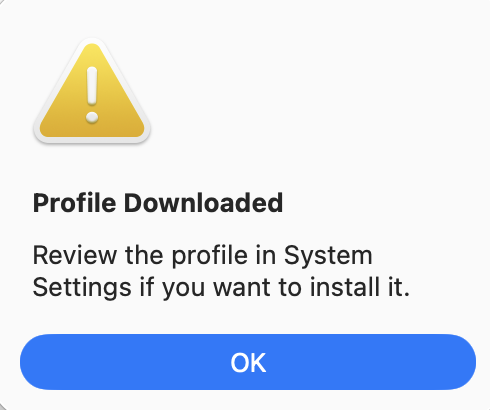
<figcaption>Notification for the new Profile to be manually reviewed.</figcaption>
</figure>

- Open *System Settings*.
- Search for *Device Management*.
- Under the *Downloaded* section, double-click the *MacOS 26 Tahoe Hardening Cloud Applications* profile.

<figure>
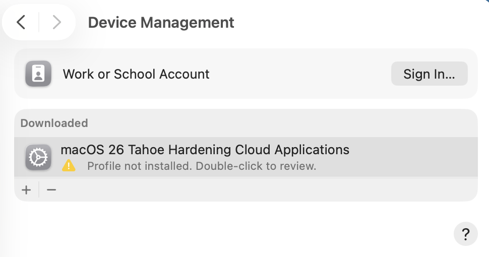
<figcaption>The downloaded, not yet installed profile.</figcaption>
</figure>

- A dialog opens asking to install the profile. Click *Install*.

<figure>
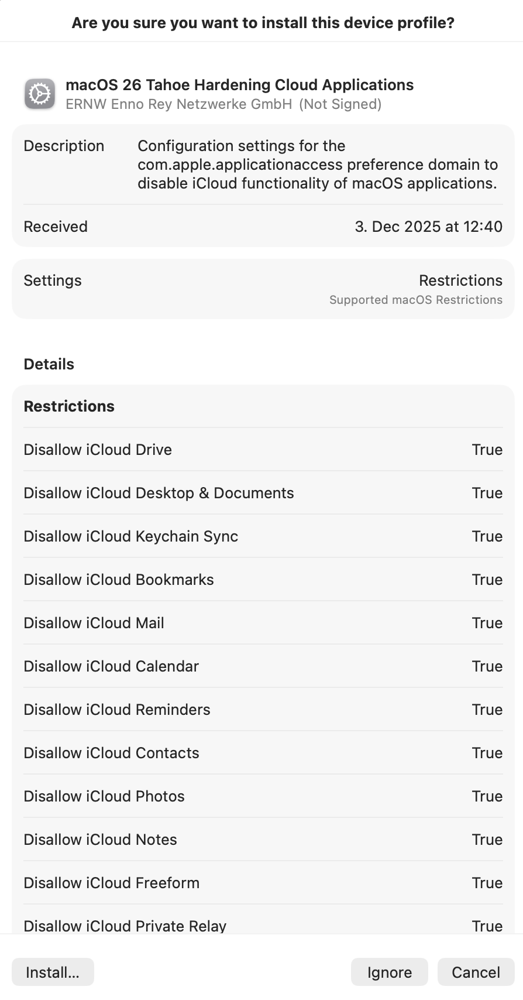
<figcaption>Installation &amp; confirmation overview.</figcaption>
</figure>

- Enter your administrative password if prompted.
- Warning Confirmation: Since this profile disables iCloud Photo Library, a warning may appear stating that unsynced items might be lost. Click *Install* to confirm. Afterward, the profile will appear in the Installed list, and the restrictions are active.

<figure>
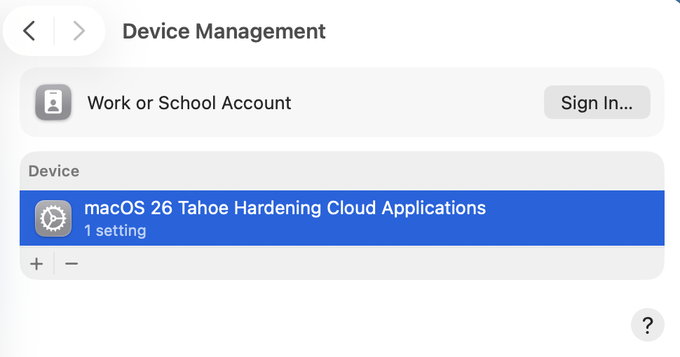
<figcaption>Installated, active profile.</figcaption>
</figure>

###### Compliance Check

To verify the values, run the following command. The output must show `0` (false) for the critical keys to confirm the policy is successfully installed.

    > sudo profiles -P -o stdout |grep -e allow
    allowActivityContinuation = 0;
    allowAutoUnlock = 0;
    allowCloudAddressBook = 0;
    allowCloudBookmarks = 0;
    allowCloudCalendar = 0;
    allowCloudDesktopAndDocuments = 0;
    allowCloudDocumentSync = 0;
    allowCloudFreeform = 0;
    allowCloudKeychainSync = 0;
    allowCloudMail = 0;
    allowCloudNotes = 0;
    allowCloudPhotoLibrary = 0;
    allowCloudPrivateRelay = 0;
    allowCloudReminders = 0;

###### Note on iCloud Private Relay

Enterprise networks may be required to audit all network traffic. *iCloud Private Relay* encrypts DNS and traffic, hindering such auditing. Therefore, iCloud Private Relay MUST be disabled in high-security environments.

Network administrators can also prevent the use of this feature network-wide by blocking DNS resolution of `mask.icloud.com` and `mask-h2.icloud.com`.

To check if your network blocks these hostnames (and thus effectively disables Private Relay), run:

    > dscacheutil -q host -a name mask.icloud.com | wc -l
    0

If the result is `0` (or empty output), the hostname is blocked or unresolvable. If it returns IP addresses (result \> 0), Private Relay is accessible.

## Disable Proximity Based Password Sharing

macOS and iOS devices include functionality to request and provide passwords to known (*trusted*) devices such as devices belonging to contacts when they are nearby. This behavior is undesired in the corporate context and therefore MUST be turned off.

To do so, install the provided `ERNW_password_sharing.mobileconfig` policy on the macOS system.

| Functionality | Configuration Key |
|---|---|
| Allow Password Sharing | `allowPasswordSharing` |
| Allow Password Proximity Requests | `allowPasswordProximityRequests` |
| Disable Auto Unlock (Apple Watch) | `allowAutoUnlock` |
| Disable Handoff and Continuity | `allowActivityContinuation` |

All keys are in the `com.apple.applicationaccess` domain and can be disabled by setting their value to `false`.

To install the policy open the policy file by double-clicking it. A notification will be shown that the profile is not installed but can be enabled in the *System Settings* App, as the following screenshot shows.

<figure>
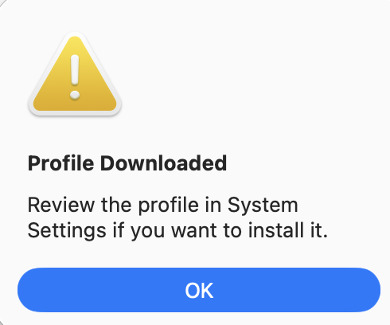
<figcaption>Profile installation notification.</figcaption>
</figure>

Open the *System Settings* App and search for *Device Management*.

<figure>
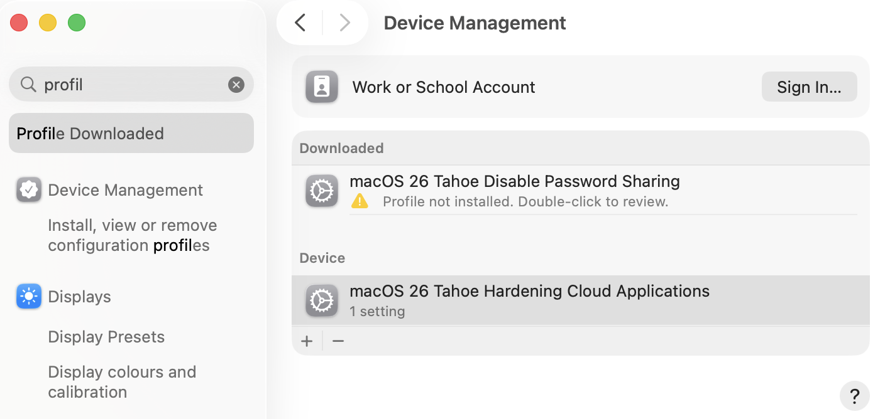
<figcaption>Open the Profiles Menu item.</figcaption>
</figure>

Under the Downloaded section, double-click the macOS 26 Tahoe Disable Password Sharing profile. A dialog opens that asks whether you want to install the profile. Click *Install…*.

<figure>
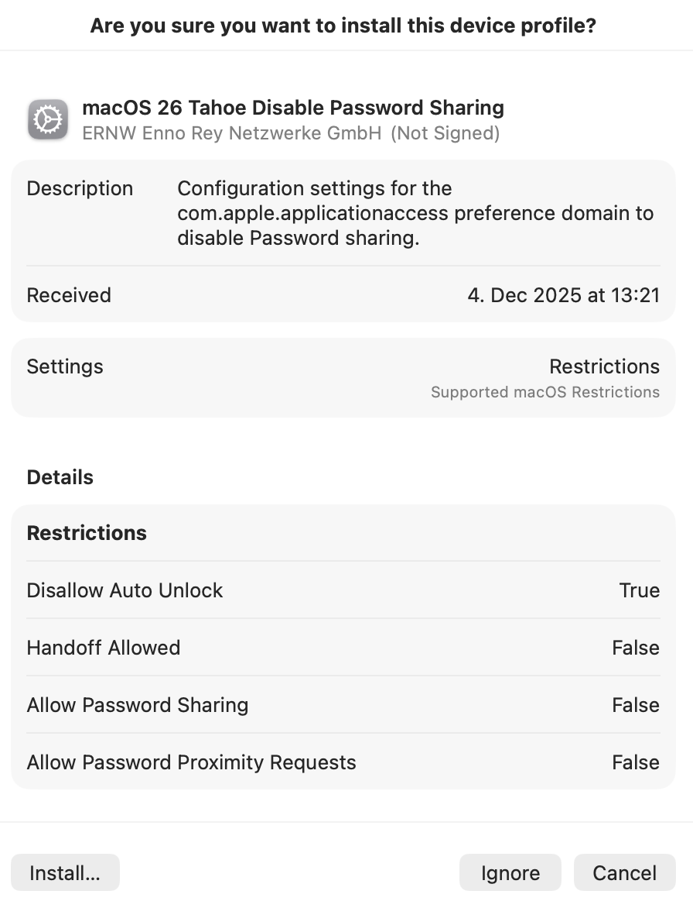
<figcaption>Install the profile after reviewing its keys and values.</figcaption>
</figure>

<figure>
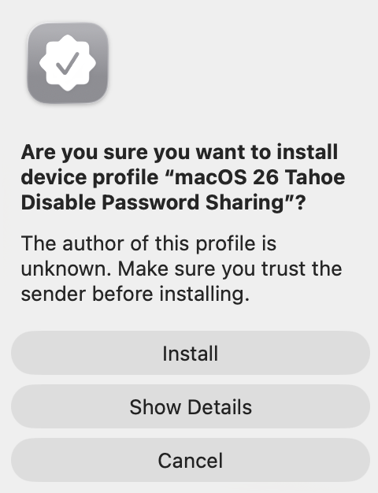
<figcaption>Install the profile.</figcaption>
</figure>

Enter your administrative password if prompted. Afterward, the profile should be installed and look similar to the following screenshot.

<figure>
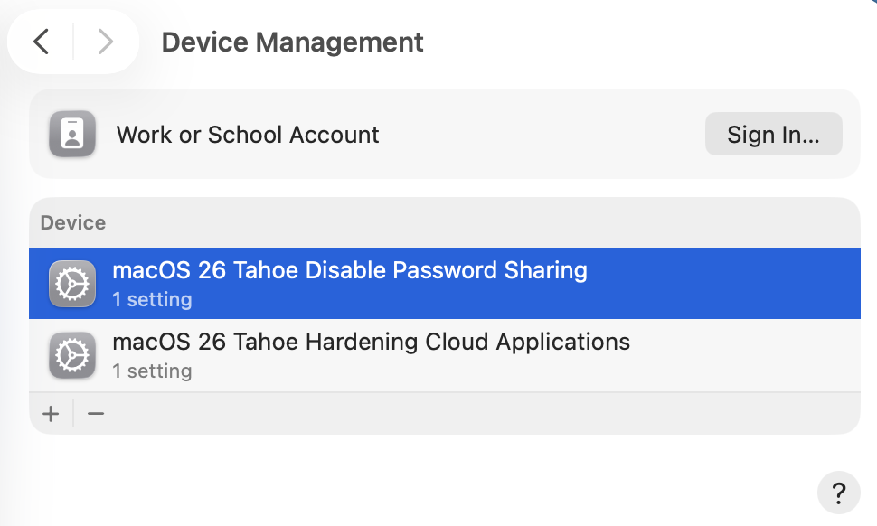
<figcaption>Installed profile in the profiles menu.</figcaption>
</figure>

To verify the values, run the following command, which should print the respective output to verify that the policy was successfully installed:

    > sudo profiles -P -o stdout |grep -e allowPasswordProximityRequests -e allowPasswordSharing
    allowPasswordProximityRequests = 0;
    allowPasswordSharing = 0;

## Disable AirPlay Receiver

AirPlay Receiver allows a Mac to receive video and audio content streamed from other Apple devices on the same network.

###### Description

While useful for consumer scenarios, this feature acts as a server service. When enabled, the Mac opens specific network ports and broadcasts its availability via Bonjour. In a corporate security context, this presents two risks: - **Attack Surface:** It needlessly exposes an open service on the network interface. - **Disruption:** Unauthorized devices could attempt to cast content to the screen, potentially interrupting presentations or workflows.

For company devices, AirPlay Receiver MUST be disabled. If a business case explicitly requires this feature (e.g., dedicated presentation laptops), it MUST be configured with a password; however, for standard clients, it remains disabled.

###### Implementation

The most reliable method to ensure this service is stopped is via the System Settings interface.

- Open *System Settings*.
- Navigate to *General* → *AirDrop & Handoff*.
- Locate the *AirPlay Receiver* toggle.
- Ensure the switch is set to *Off*.

<figure>
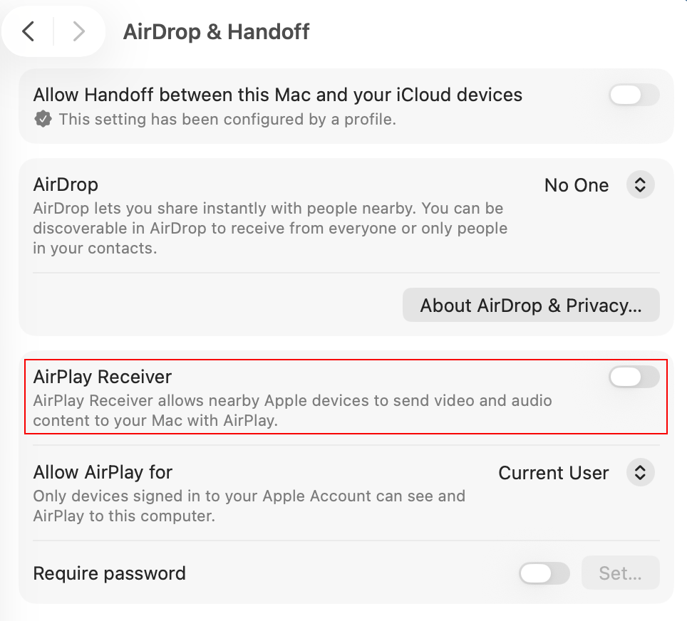
<figcaption>System Settings showing AirPlay Receiver disabled.</figcaption>
</figure>

> **Note:** Configuration Profiles (MDM) can enforce this setting, but on non-supervised devices, they may not permanently lock the UI. Manual verification is recommended during the setup.

###### Compliance Check

To verify that the AirPlay Receiver is disabled and the preference is correctly set, run the following command:

    > defaults -currentHost read com.apple.controlcenter AirplayReceiverEnabled
    0

The output MUST be `0` (false). If the output is `1` or the key is missing (defaulting to enabled on some models), the setting must be adjusted.

## Restrict SSH Client Ciphers and Algorithms

###### Description

The default cryptographic primitives used by SSH clients prioritize compatibility over security. To mitigate attacks such as Logjam, weak key negotiation, or future quantum-decryption, a restricted list of algorithms MUST be enforced.

The configuration below is optimized for modern macOS environments (OpenSSH 9.8+), utilizing *Post-Quantum Cryptography (ML-KEM/Kyber)* and hardware-backed keys. These settings MUST be applied to the user’s SSH configuration file (`\~/.ssh/config`) under the global `Host *` directive.

Append the following configuration block to `\~/.ssh/config`.

This configuration:

- **KexAlgorithms:** Prioritizes `mlkem768x25519-sha256` (NIST Standard Post-Quantum) and sntrup761 (OpenSSH Post-Quantum). It strictly avoids weak Diffie-Hellman groups.
- **Ciphers:** Prioritizes ChaCha20-Poly1305 and AES-GCM (Authenticated Encryption).
- **MACs:** Enforces Encrypt-then-MAC (EtM).
- **HostKeyAlgorithms:** Includes support for sk-ssh-ed25519 (Hardware Security Keys / YubiKey) and standard Ed25519, explicitly permitting only SHA-2 signatures for RSA.

<!-- -->

    # Restrict Ciphers for ALL connections
    Host *
      Ciphers chacha20-poly1305@openssh.com,aes256-gcm@openssh.com,aes128-gcm@openssh.com,aes256-ctr,aes192-ctr,aes128-ctr
      MACs hmac-sha2-512-etm@openssh.com,hmac-sha2-256-etm@openssh.com,umac-128-etm@openssh.com
      KexAlgorithms mlkem768x25519-sha256,sntrup761x25519-sha512@openssh.com,sntrup761x25519-sha512,curve25519-sha256@libssh.org,curve25519-sha256,diffie-hellman-group18-sha512,diffie-hellman-group16-sha512
      HostKeyAlgorithms ssh-ed25519-cert-v01@openssh.com,ssh-ed25519,sk-ssh-ed25519-cert-v01@openssh.com,sk-ssh-ed25519@openssh.com,rsa-sha2-512,rsa-sha2-256

> **Note:** If you need to connect to a legacy server that does not support these algorithms, define a specific `Host` block with weaker algorithms rather than weakening the global configuration.

## Privacy, Permissions & Location Services

This section guides the administrator through a manual review of the *Privacy & Security* settings pane.

###### Apple Intelligence & Analytics

To prevent the generation of local logs regarding AI queries and to limit the transmission of system analytics to Apple, these settings MUST be configured manually.

###### Turn Off Apple Intelligence Report

The *Apple Intelligence Report* logs requests sent to Apple’s Private Cloud Compute (PCC). While intended for transparency, high-security environments often require disabling unnecessary logging features.

###### Implementation

- Go to *System Settings* → *Privacy & Security*.
- Scroll down to *Apple Intelligence Report*.
- Set the reporting duration to *Off*.

###### Privacy Permissions Review

The *Privacy & Security* pane lists various hardware and data categories (e.g., *Camera*, *Microphone*, *Motion & Fitness*). Next to some categories, you may see a number (e.g., *“0”*). This indicates the *count of applications* that have requested or been granted access to that specific data category. *“0”*: This is the ideal state for sensitive categories like *Motion & Fitness* or *HomeKit* on a corporate device, indicating that *no apps* have access.

###### Review Procedure

Users MUST manually review the following categories. If any application is listed that is not regularly required for business purposes, its access MUST be revoked.

| Category | Recommended State |
|---|---|
| Camera / Microphone | Restricted |
| Screen Recording | Highly Restricted |
| Files and Folders | Restricted |
| Motion & Fitness | No applications |
| HomeKit | No applications |
| Bluetooth | Restricted |

###### Location Services Configuration

Location services enable applications and websites to gather and use information based on the current location of the computer.

###### High Security Policy (Optional)

For systems handling highly sensitive data, the most secure configuration is to disable Location Services entirely. This prevents the unauthorized connection of devices and disclosure of physical location.

###### Compliance Check

This check searches all location configuration files. If *any* file reports that Location Services are enabled (`1`), the check will fail. For a fully hardened system, the result must be `0`.

    > sudo find /private/var/db/locationd/Library/Preferences/ByHost -name "com.apple.locationd.*.plist" -exec defaults read {} LocationServicesEnabled \; 2>/dev/null | grep -c 1
    0

###### Manual Implementation

To disable all Location Services system-wide:

- Go to *System Settings* → *Privacy & Security* → *Location Services*.
- Toggle *Location Services* to *Off*.

> **Note:** Disabling Location Services will break “Find My Mac” and automatic Time Zone updates. If these features are business-critical, keep Location Services enabled but ensure that the list of apps using location is empty or strictly limited.

## Post-Quantum Cryptography (PQC)

Apple has implemented Post-Quantum Cryptography (PQC) in macOS Tahoe to protect against the “harvest now, decrypt later” threat scenario. This implementation uses a hybrid key exchange for TLS 1.3, combining the classical X25519 elliptic curve with the quantum-resistant **ML-KEM-768** (Module-Lattice Key Encapsulation Mechanism). This combination, referred to as `X25519MLKEM768`, ensures that data remains secure against future quantum decryption capabilities while maintaining the proven security of classical algorithms today. Administrators can verify that the system is correctly advertising and negotiating quantum-secure connections using network analysis tools or built-in system diagnostics.

The following screenshot shown in <a href="#fig:wireshark" data-reference-type="ref+label" data-reference="fig:wireshark">7.2</a> demonstrates a TLS 1.3 handshake initiated by a macOS client.

In the *Client Hello* packet, the client advertises its cryptographic capabilities to the server.

- Supported Groups (`0x000a`): The client lists `X25519MLKEM768 (0x11ec)` as a supported group.
- Key Share (`0x0033`): The client preemptively sends the public key material for `X25519MLKEM768`. This allows the server to complete the handshake in a single round-trip if it also supports PQC.

To filter for this specific quantum-secure exchange in Wireshark, use the following display filter `tls.handshake.extensions_key_share_group == 4588 || tls.handshake.extensions_supported_group == 0x11ec` where `4588` is the decimal representation of the hex ID `0x11ec`.

<figure id="fig:wireshark">
<div id="fig:wireshark">
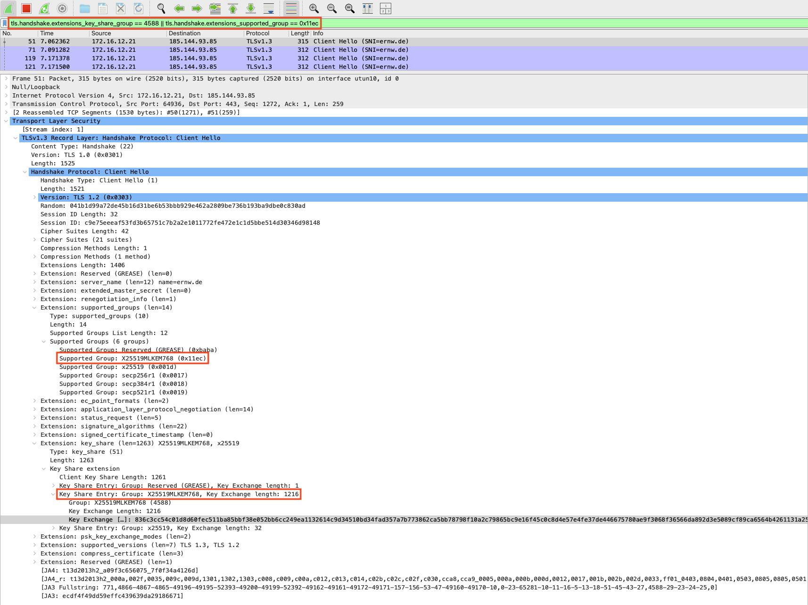
</div>
<figcaption>Wireshark capture showing the X25519MLKEM768 Key Share extension.</figcaption>
</figure>

> **Note:** This behavior has been verified with native applications like **Safari**, as well as Chromium-based browsers such as **Brave**.

Furthermore, you can verify the negotiation status directly via the command line using the `nscurl` diagnostic tool[^33].

Run the following command to test a connection to a PQC-enabled host (e.g., google.com):

    > nscurl --tls-diagnostics https://google.com
    Starting TLS Diagnostic

    ================================================================================

    Negotiated TLS version (codepoint): 0x0304
    Negotiated TLS key exchange group (name): X25519MLKEM768
    Negotiated TLS ciphersuite (codepoint): 0x1302

    ================================================================================

The output `Negotiated TLS key exchange group (name): X25519MLKEM768` confirms that the hybrid post-quantum key exchange was successfully negotiated.

###### Enforcing Quantum Security

While PQC is the default behavior, a compatibility mode exists that allows the system to fallback to classical cryptography if a server fails to handle the larger Client Hello message. For a strictly hardened environment, this fallback MUST be disabled to ensure quantum resistance is never silently downgraded.

###### Compliance Check

Check if the fallback compatibility mode is disabled (key absent or set to 0).

    > defaults read com.apple.network.tls AllowPQTLSFallback 2>/dev/null
    0

###### Implementation

To enforce strict PQC negotiation and disable the fallback:

    defaults delete com.apple.network.tls AllowPQTLSFallback

*(Note: If the key does not exist, the system defaults are used. Explicitly ensuring it is not set to `1` is the goal).*

## Apple Intelligence & Siri

Apple Intelligence and Siri are tightly integrated technologies in macOS Tahoe. While marketed with privacy features like *Private Cloud Compute (PCC)*, the architecture inevitably involves complex data processing pipelines that can extend beyond the local device. For company systems, a Zero Trust approach applies to data processing: We cannot verify the integrity or security of the external compute endpoint (PCC). Therefore, *all* components of the Apple Intelligence suite and the Siri voice assistant MUST be permanently disabled to prevent accidental transmission of sensitive corporate data.

###### Disable Siriaudio Content Streamed from Other Apple Devices on the Same Network.

It cannot be ruled out that data is transmitted to Apple when using Siri in a corporate context. Therefore, the voice assistant service MUST be disabled as the first line of defense.

###### Compliance Check

- Navigate to *System Settings* → *Apple Intelligence & Siri*
- Verify that *Siri* is *unchecked*.

<figure>
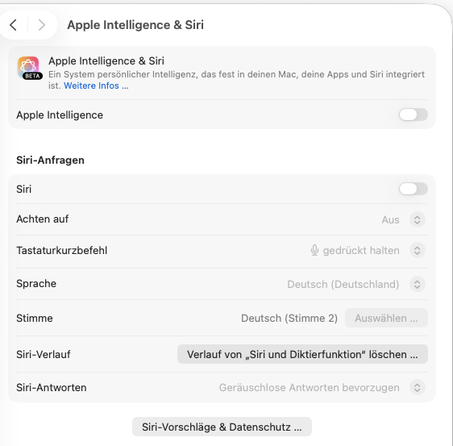
<figcaption>Disable Siri in the System Settings.</figcaption>
</figure>

###### Disable Apple Intelligence

Apple Intelligence introduces generative models for writing, image creation, and notification summarization. Even if “On-Device Processing” is preferred by the OS, the system is designed to seamlessly offload complex tasks to Apple’s cloud servers (PCC).

To eliminate the risk of data egress, these features MUST be disabled globally.

###### Compliance Check

- Navigate to *System Settings* → *Apple Intelligence & Siri*
- There, deactivate the Switch next to *Apple Intelligence*
- Acknowledge the warning about turning it off

<figure>
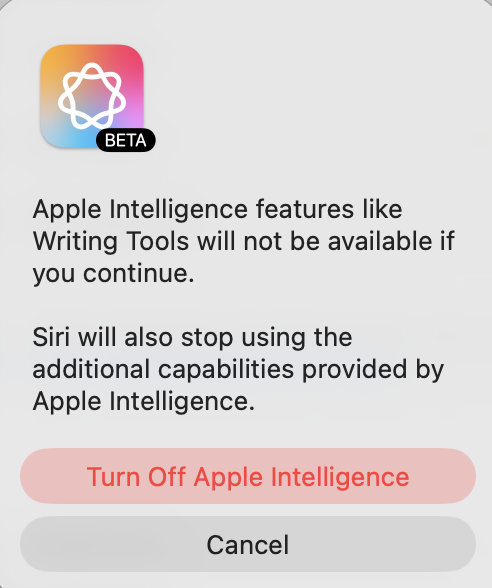
<figcaption>Acknowledge the warning about turning off Apple Intelligence.</figcaption>
</figure>

# Application & Software Integrity

This chapter groups policies related to the security of the software lifecycle, from installation to execution.

## Software Management and Third-Party Sources

###### Software Management and Third-Party Sources

Managing third-party software on macOS introduces significant risks, particularly when using command-line package managers like Homebrew. By default, these tools prioritize convenience over strict security auditing.

To harden the software lifecycle, two critical areas must be addressed:

- Hardening the package manager itself against tracking and insecure network redirects (e.g., Homebrew, MacPorts)
- *Terminal Privileges:* Ensuring the shell environment (Terminal, iTerm2) is not granted excessive permissions (like *Full Disk Access*) that malicious installation scripts could exploit to bypass system sandboxes.

###### Privilege Avoidance (TCC Audit)

A common but dangerous anti-pattern in macOS administration is granting *Full Disk Access (FDA)* or *App Management* permissions to the Terminal application to resolve Permission Denied errors.

If the Terminal app has *Full Disk Access*, every script run inside it (including `brew install` or `npm install`) inherits these permissions. This effectively bypasses the macOS TCC (Transparency, Consent, and Control) privacy framework, allowing a malicious installation script to exfiltrate Safari history, Mail data, or Messages databases without prompting the user.

Therefore, terminal emulators such as *Terminal.app*, *iTerm2*, *Warp* should minimize their *Full Disk Access* or *App Management* permissions. These permissions should only be granted temporarily for specific administrative tasks and revoked immediately afterward.

###### Compliance Check

- Go to *System Settings* → *Privacy & Security*.
- Click on *Full Disk Access*. Review the list for *Terminal* (and iTerm/others).
- Go back and click on *App Management*. Review the list for *Terminal*.

###### Implementation

To revoke potentially dangerous permissions:

- Navigate to *System Settings* → *Privacy & Security*.
- Select *Full Disk Access*.
- Toggle the switch for *Terminal* to disabled (gray) or select the entry and click the minus (-) button to remove it.
- Repeat the process for the *App Management* section.

## XProtect & Malware Remediation

*XProtect* is Apple’s built-in anti-malware technology. Unlike traditional antivirus software that runs constant real-time hooks, XProtect operates in two distinct layers to maintain system performance while ensuring security.

###### Description:

- **XProtect (Signatures):** A signature-based engine that scans files upon first launch or modification. It works in conjunction with Gatekeeper (<a href="#01-05-gatekeeper" data-reference-type="ref+label" data-reference="01-05-gatekeeper">3.5</a>) to block known malware execution.
- **XProtect Remediator:** A more advanced, periodic background service (introduced in macOS 12.3) that scans for and remediates malware that may have bypassed initial defenses. It runs specifically scheduled scans for high-prevalence threats (e.g., Adload, DubRobber) without user intervention.

Both components rely on silent, automatic updates from Apple, independent of major macOS OS upgrades. These must be operational to ensure baseline protection.

###### Compliance Check

Verify XProtect Signature Version

This check confirms that the core signature bundle (`XProtect.meta.plist`) is present and has a valid version number. This proves the system is successfully ingesting “XProtectPlistConfigData” updates.

    > defaults read /Library/Apple/System/Library/CoreServices/XProtect.bundle/Contents/Resources/XProtect.meta.plist Version
    5323

> **Note**: *The version number increases frequently. Any integer output indicates the file is readable and versioned.*

Verify XProtect Remediator Presence

Unlike standard daemons, `XProtectRemediator` runs as an on-demand XPC service and will not appear in a standard `launchctl list` unless it is actively scanning at that exact second. Therefore, compliance is checked by verifying the *integrity* and *version* of the Remediator application bundle itself.

    > defaults read /Library/Apple/System/Library/CoreServices/XProtect.app/Contents/Info.plist CFBundleShortVersionString
    5323

If this command returns a version number, the Remediator module is correctly installed.

To see when XProtect last performed a scan or remediation, you can query the system logs:

    > log show --predicate 'subsystem == "com.apple.XProtectFramework.PluginAPI"' --last 24h

###### Implementation

Ensuring Updates Are Current

XProtect definitions and Remediator modules are delivered as “System Data Files” and “Security Responses”. They do not require a restart. To ensure these are applied automatically.

Troubleshooting

If the checks above fail (e.g., file not found):

- **Force Update:** Run the following command to trigger a background check for system data files:

<!-- -->

    > sudo softwareupdate --background

- **Verify SIP:** Ensure *System Integrity Protection* (SIP) is enabled (<a href="#01-02-sip" data-reference-type="ref+label" data-reference="01-02-sip">3.2</a>). XProtect resides in a protected system location; if SIP is disabled, malware could theoretically modify or delete the XProtect binaries.
- **Network Filtering:** Ensure corporate firewalls are not blocking access to `swscan.apple.com` or `gdmf.apple.com`, which are used to fetch these definitions.

## Application Sandboxing

Application Sandboxing is a security mechanism that restricts the resources an application can access. When an application is sandboxed, it is confined to a specific container (its "sandbox") and only allowed to access files, network services, and peripherals through explicit entitlements granted by the operating system.

###### Description

Running applications without any form of sandboxing is highly dangerous, as a compromised application could gain unrestricted access to the user's sensitive files, SSH keys, and the entire file system outside the application's immediate control.

macOS supports two primary sandboxing mechanisms:

- **App Sandbox (Static Entitlement):** Declared via the `com.apple.security.app-sandbox` entitlement at build time. This is mandatory for all Mac App Store (MAS) submissions and enforced by the system at launch. The application runs inside a container with only explicitly granted capabilities.
- **Runtime Sandboxing (Dynamic/Hybrid):** Some applications, most notably Chromium-based browsers (Google Chrome, Microsoft Edge, Brave) and Firefox, implement their own sandbox architecture. These applications do *not* carry the static `com.apple.security.app-sandbox` entitlement. Instead, the main process runs unsandboxed to manage child process lifecycle, while each child process (Renderer, GPU, Utility) calls the macOS Seatbelt sandbox API (`sandbox_init`) at runtime with a tailored, restrictive profile. This is a deliberate architectural decision that provides per-process, role-specific sandboxing rather than a single blanket policy.

All critical corporate applications MUST be sandboxed by one of the two mechanisms described above. Applications downloaded from outside the Mac App Store SHOULD be audited to ensure they maintain this security posture and do not request excessive exceptions.

> **Note:** The absence of the static `com.apple.security.app-sandbox` entitlement does **not** necessarily mean an application is unsandboxed. Verify using the runtime checks described below before concluding an application is non-compliant.

###### Compliance Check

**Method 1: Verify Static App Sandbox Entitlement**

The following command verifies the entitlements of a specified application. In this example, we verify Microsoft Teams. The output format is an indentation-based dictionary, *not* XML.

```
> codesign --display --entitlements - /Applications/Microsoft\ Teams.app
```

The output MUST contain the sandboxing key:

```
    [Key] com.apple.security.app-sandbox
    [Value]
        [Bool] true
```

Applications that carry this entitlement are statically sandboxed by the operating system.

**Method 2: Verify Runtime Sandboxing (for applications without the static entitlement)**

Applications such as Google Chrome or Firefox use a hybrid sandbox design where the main (browser) process is *not* statically sandboxed, but all child processes are sandboxed at runtime. To verify this behavior:

1. Launch the application (e.g., Google Chrome).
2. Identify a child process (e.g., a Renderer or GPU helper) using Activity Monitor or `pgrep`:

```
> pgrep -fl "Google Chrome Helper"
98269 [...] Google Chrome Helper --type=gpu-process [...] --seatbelt-client=20
98270 [...] Google Chrome Helper --type=utility [...] --service-sandbox-type=network [...] --seatbelt-client=20
98271 [...] Google Chrome Helper --type=utility [...] --service-sandbox-type=service [...] --seatbelt-client=37
```

> **Note:** The `--seatbelt-client=<fd>` argument on each child process indicates the file descriptor for the Seatbelt sandbox profile passed at launch, confirming the runtime sandbox mechanism is active.

3. Use `launchctl procinfo` on a child process PID to verify its sandbox state. This command requires root privileges:

```
> sudo launchctl procinfo <child-PID> | grep -i sandbox
sandboxed = probably
```

A value of `sandboxed = probably` on child processes confirms that runtime sandboxing is active. The parent browser process will show `sandboxed = no`, which is expected for this architecture.

Alternatively, open **Activity Monitor**, enable the *Sandbox* column via *View → Columns*, and verify that child/helper processes of the application show as sandboxed.

**Method 3: Verify Hardened Runtime**

All notarized applications (required for distribution outside the MAS since macOS 10.15) MUST use the Hardened Runtime. This can be verified with:

```
> codesign --display --verbose /Applications/Google\ Chrome.app
Executable=/Applications/Google Chrome.app/Contents/MacOS/Google Chrome
Identifier=com.google.Chrome
Format=app bundle with Mach-O universal (x86_64 arm64)
CodeDirectory v=20500 size=893 flags=0x12a00(kill,restrict,library-validation,runtime) hashes=17+7 location=embedded
Signature size=8990
[...]
```

The `flags` field MUST contain `runtime`. For example, `flags=0x12a00(kill,restrict,library-validation,runtime)` confirms that the Hardened Runtime is enabled alongside additional protections.

###### Audit of Sandbox Exceptions

Merely having the App Sandbox enabled is not sufficient if the application requests broad exceptions that punch holes in the container. Applications with the static `com.apple.security.app-sandbox` entitlement SHOULD be audited for excessive exceptions.

Run the check for the application in question. The following example shows an analysis of Microsoft Teams, which acts as a negative example due to the extensive list of exceptions and entitlements required for its operation (e.g., JIT compilation, direct access to specific sockets, or broad file system access):

```
> codesign --display --entitlements - /Applications/Microsoft\ Teams.app

Executable=/Applications/Microsoft Teams.app/Contents/MacOS/MSTeams
[Dict]
    [Key] com.apple.application-identifier
    [Value]
        [String] UBF8T346G9.com.microsoft.teams2
    [Key] com.apple.developer.associated-domains
    [Value]
        [Array]
            [String] webcredentials:login.microsoft.com
            [String] webcredentials:login.microsoftonline.us
            [String] webcredentials:login.partner.microsoftonline.cn
    [Key] com.apple.developer.team-identifier
    [Value]
        [String] UBF8T346G9
    [Key] com.apple.developer.usernotifications.communication
    [Value]
        [Bool] true
    [Key] com.apple.security.app-sandbox
    [Value]
        [Bool] true
    [Key] com.apple.security.application-groups
    [Value]
        [Array]
            [String] UBF8T346G9.com.microsoft.teams
            [String] UBF8T346G9.com.microsoft.oneauth
            [String] UBF8T346G9.com.microsoft.entrabroker
    [Key] com.apple.security.cs.allow-jit
    [Value]
        [Bool] true
    [Key] com.apple.security.device.audio-input
    [Value]
        [Bool] true
    [Key] com.apple.security.device.bluetooth
    [Value]
        [Bool] true
    [Key] com.apple.security.device.camera
    [Value]
        [Bool] true
    [Key] com.apple.security.device.microphone
    [Value]
        [Bool] true
    [Key] com.apple.security.device.print
    [Value]
        [Bool] true
    [Key] com.apple.security.device.usb
    [Value]
        [Bool] true
    [Key] com.apple.security.files.bookmarks.app-scope
    [Value]
        [Bool] true
    [Key] com.apple.security.files.downloads.read-write
    [Value]
        [Bool] true
    [Key] com.apple.security.files.user-selected.read-write
    [Value]
        [Bool] true
    [Key] com.apple.security.network.client
    [Value]
        [Bool] true
    [Key] com.apple.security.network.server
    [Value]
        [Bool] true
    [Key] com.apple.security.personal-information.location
    [Value]
        [Bool] true
    [Key] com.apple.security.print
    [Value]
        [Bool] true
    [Key] com.apple.security.temporary-exception.sbpl
    [Value]
        [Array]
            [String] (allow mach-lookup (global-name "com.apple.mdmclient.daemon.unrestricted"))
            [String] (allow mach-lookup (global-name "com.apple.ReportCrash"))
            [String] (allow ipc-posix-sem* (ipc-posix-name-prefix "/Smartscreen-anaheim"))
            [String] (allow mach-register mach-lookup (global-name-prefix "com.microsoft.edgemac.mojo"))
            [String] (allow mach-register mach-lookup (global-name-prefix "org.chromium.crashpad.child_port_handshake"))
            [String] (allow mach-register mach-lookup (global-name-prefix "com.microsoft.teams2.helper.local.MachPortRendezvousServer"))
            [String] (allow mach-register mach-lookup (global-name-prefix "com.microsoft.teams2.helper.MachPortRendezvousServer"))
            [String] (allow mach-register mach-lookup (global-name-prefix "mach.streamrender"))
            [String] (allow file-read* file-write* (subpath "/dev/fd"))
            [String] (allow file-read* file-write* (subpath "/private/var/folders"))
            [String] (allow file-read* file-write* (subpath "/usr/local/var/run/lldpd.socket"))
            [String] (allow file-read* (subpath "/Library/Logs/DiagnosticReports"))
            [String] (allow file-read* (subpath "/Library/Logs/Microsoft/MSTeams"))
            [String] (allow file-read* (home-subpath "/Library/Logs/DiagnosticReports"))
            [String] (allow user-preference-read (preference-domain "com.apple.mdmclient"))
            [String] (allow user-preference-read (preference-domain "com.apple.SystemConfiguration"))
            [String] (allow user-preference* (preference-domain "com.microsoft.teams2.defaults"))
            [String] (allow user-preference* (preference-domain "com.microsoft.teams2.helper"))
            [String] (allow user-preference* (preference-domain "com.microsoft.autoupdate2"))
            [String] (allow user-preference-read (preference-domain "com.microsoft.office"))
            [String] (allow user-preference-read (preference-domain "com.microsoft.teams"))
            [String] (allow network* (remote unix))
            [String] (allow network-outbound (subpath "/usr/local/var/run/lldpd.socket"))
            [String] (allow process-exec* (literal "/Library/Application Support/Microsoft/MAU2.0/Microsoft AutoUpdate.app/Contents/MacOS/msupdate"))
            [String] (allow mach-lookup (global-name "com.microsoft.update.xpc"))
            [String] (allow distributed-notification-post)
            [String] (allow job-creation)
            [String] (allow iokit-open (iokit-registry-entry-class-prefix "AppleSMC"))
            [String] (allow file-read-metadata (literal "/Library/Caches/com.microsoft.autoupdate.helper/Clones.noindex"))
            [String] (allow file-read-xattr file-write-xattr (xattr "com.apple.quarantine"))
    [Key] keychain-access-groups
    [Value]
        [Array]
            [String] UBF8T346G9.com.microsoft.identity.universalstorage
```

###### Implementation

If an application is found to be running without any form of sandboxing (neither the static entitlement nor runtime sandbox enforcement) or with excessive, unjustified exceptions:

1. **Identify:** Run the `codesign` entitlement check and, if the static entitlement is absent, verify runtime sandboxing via `sudo launchctl procinfo` or Activity Monitor.
2. **Replace:** Prefer downloading the application from the Mac App Store (MAS), as Apple mandates stricter sandboxing for all MAS submissions.
3. **Mitigate:** If a business-critical application requires broad exceptions (like Teams) or uses runtime sandboxing without the static entitlement (like Chrome), ensure it is kept strictly up-to-date to minimize the risk of the weakened or non-standard sandbox being exploited.
4. **Verify Hardened Runtime:** As a baseline, all applications MUST at minimum have the Hardened Runtime enabled (`flags=0x...(runtime)`), regardless of their sandboxing approach.

# Additional Security Hardening

## SSH Secret Management

This section will lay out secure SSH keys with macOS, such as managing SSH keys in Secure Enclave.

### Use of Host-Specific Keys and Config

A unique SSH key pair MUST be created for every server the client connects. If the private key is compromised, this limits the access attackers would have to that single host.

We create a new SSH key for that server. For more information about creating SSH keys, see *How to use ssh-keygen to generate a new SSH key*[^34].

    > ssh-keygen -f ~/.ssh/test2 -t ed25519
    Generating public/private ed25519 key pair.
    Enter passphrase (empty for no passphrase): 
    Enter same passphrase again: 
    Your identification has been saved in /Users/ernw/.ssh/test2
    Your public key has been saved in /Users/ernw/.ssh/test2.pub
    The key fingerprint is:
    SHA256:oYndAbiMYZ1ecNPcd46vdB4S6xFWz0UTqTUC2xP34Kg ernw@hardening.local
    The key's randomart image is:
    +--[ED25519 256]--+
    [...]
    +----[SHA256]-----+

After this step, we specify this key in our SSH configuration file with an extra `Host` entry. Then, with the `IdentityFile` option, we specify which specific key pair our SSH agent should use when connecting to that server. Further, specifying `IdentitiesOnly yes` hinders our agent from trying out all available keys.

    Host test2
     Hostname 192.168.56.102
     Port 22
     User user
     IdentitiesOnly yes
     IdentityFile ~/.ssh/test2

### Generate and Manage SSH Keys in Secure Enclave

A system is configured to provide secure storage for cryptographic keys either by hardware protected key store or an organizationally defined safeguard. Macs with Apple Silicon or T2 processors provide protected storage for cryptographic keys via the secure enclave.[^35]

> **Note:** *We will use Secretive to generate and manage SSH key pairs in the secure enclave. This app is using the Secure Enclave API provided by Apple. Secretive is an app for storing and managing SSH keys in the Secure Enclave.* [^36]

First, install *Secretive* on your system. Then, create a new SSH key, click on *+* in the upper right corner, and give your new key pair a name. Finally, select *Require Authentication (Biometrics or Password) before each use* to limit access to the private key. After creating the key pair, the key is shown in the Secretive user interface.

<figure>
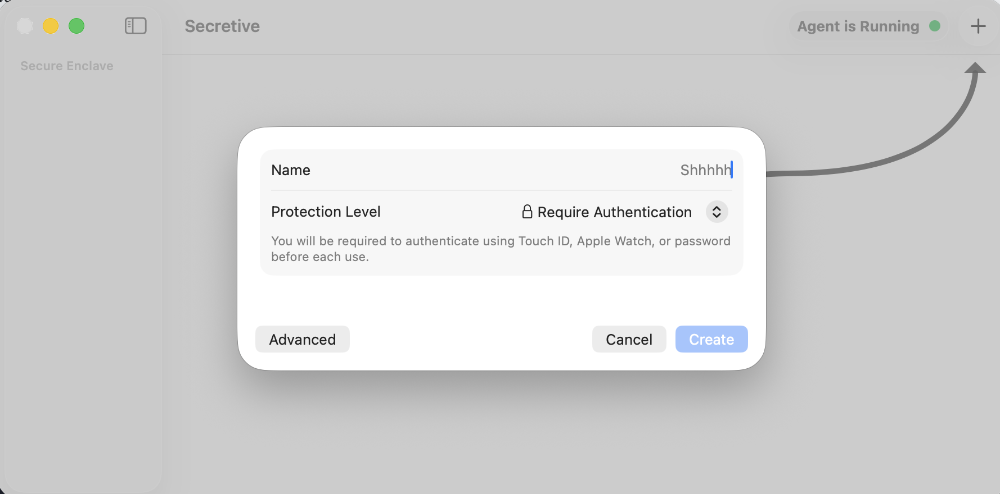
<figcaption>Create a new key by requiring authentication before each use.</figcaption>
</figure>

<figure>
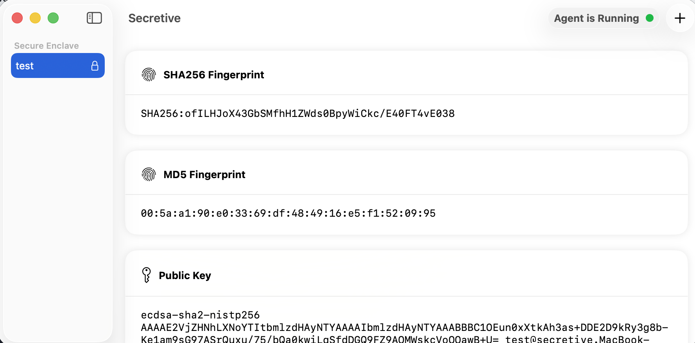
<figcaption>Secretive user interface showing the new key.</figcaption>
</figure>

Copy the public key path from Secretive and append a host-specific entry to the SSH configuration (`\~/.ssh/config`). Then, create a host entry, define the identity file as that public key, and adjust the respective values.

    # Example Configuration
    Host test
     Hostname 192.168.56.101
     User ernw
     Port 22
     IdentityFile /Users/<username>/Library/Containers/com.maxgoedjen.Secretive.SecretAgent/Data/PublicKeys/<key-id>.pub
     IdentitiesOnly yes

Connect to your service and set up public-key authentication using the previously defined public key. Then reconnect:

    ssh test

When everything is set up correctly, a prompt from Secretive for authentication is opened. Confirm that prompt with Touch ID or by entering your password.

## Files in Encrypted Disk Images

macOS offers functionality to create encrypted local containers. If you have confidential documents that you do not want others to see without your permission, you can put them in an encrypted disk image[^37]. These disk images can be used to organize sensitive data stored in the file system that is not needed frequently or to control which data is exposed to the system manually.

### Creating a Secure Disk Image via Disk Utility

Open the Disk Utility application and select *File* → *New Image* → *Blank Image*.

<figure>

<figcaption>Filename and location of the secure disk image.</figcaption>
</figure>

A dialog with the disk image settings opens.

<figure>
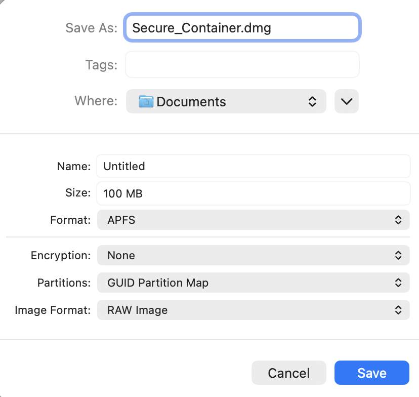
<figcaption>Disk image setup dialog</figcaption>
</figure>

- Enter a filename for the disk image (name of encrypted image), then choose a location for this disk image.
- In the *Name* field, enter the name for the disk image (name when unlocked and mounted).
- In the Size field, enter a size for the disk image.
- Select APFS as *Format*
- Click the Encryption pop-up menu, and choose the 256-bit encryption option
- Enter and re-enter a password to unlock the disk image, then click Choose
- *Partitions*: choose *Single partition - GUID Partition Map* (default)
- Select *Image Format* as *read/write disk image*
- Click Save, then click Done.

> **Note:** *If you forget the disk image’s password, you will not be able to open the disk image and view any of the files. It is recommended to store the secret in a password manager (but not in keychain as this auto-mounts the image without a password prompt which may not be desired in many cases!).*

The password MUST be compliant to the following rules:

- Minimum password length of at least 24 characters
- Must not contain any default passwords
- Must consist of at least 6 different characters

Disk Utility creates the disk image file where you saved it in the Finder and mounts its disk icon on your desktop and in the Finder sidebar.

<figure>

<figcaption>Created secure disk image.</figcaption>
</figure>

### Creating a Secure Disk Image via Terminal

Secure disk images can also be created using the `hdiuitil` utility. Specify the container size in blocks (`b`), kilo- (`k`), mega- (`m`), giga- (`g`), tera- (`t`) or exa-bytes (`e`). Further, chose a name for the encrypted container as well as a volume name that is shown when unlocked and mounted. The utility will ask for the encryption password.

    > hdiutil create -encryption AES-256 -size 1g -volname "name when mounted" image_name.dmg
    Enter a new password to secure "image_name.dmg": 
    Re-enter new password: 
    ............[...]........
    created: /Users/ernw/Documents/image_name.dmg

The image can be inspected with the `hdiutil imageinfo <image>.dmg` command which will print much information about the disk image such as information about all partitions, the encryption algorithm and more. Here we select, the in this section most interesting information about the encryption:

    hdiutil imageinfo image_name.dmg |grep -e "Format:" -e "\tEncryp" 
    Enter password to access "image_name.dmg": 
    Format: UDRW
            Encrypted: true
            Encryption: AES-256

### Mounting a Secure Disk Image

Click on the encrypted disk image (`.dmg`) to start mounting. A password prompt appears. Enter the password and click on OK. *Remember password in my keychain* MUST be unchecked. Checking that box will allow macOS to automatically mount the image *without* prompting for the password.

The disk image will be mounted and available on the desktop with the name specified when creating the disk image. The files in the disk image can be used as every other regular directory or file present on the macOS file system.

[^1]: Keywords for use in RFCs to Indicate Requirement Levels: <https://datatracker.ietf.org/doc/html/rfc2119>

[^2]: Mac models with the Apple T2 Security Chip: <https://support.apple.com/en-us/HT208862>

[^3]: Mac computers with Apple Silicon: <https://support.apple.com/en-gb/HT211814>

[^4]: Boot modes of an Intel-based Mac with T2 Security Chip: <https://support.apple.com/en-gb/guide/security/sec7703b1423>

[^5]: About Startup Security Utility on a Mac with the Apple T2 Security Chip: <https://support.apple.com/en-us/HT208198> and <https://support.apple.com/en-gb/guide/security/secc7b34e5b5>

[^6]: Mac computers with Apple Silicon: <https://support.apple.com/en-gb/HT211814>

[^7]: Boot process for a Mac with Apple Silicon: <https://support.apple.com/en-gb/guide/security/secac71d5623>

[^8]: Startup security in macOS: <https://support.apple.com/en-bn/guide/deployment/dep5810e849c>

[^9]: Startup Disk security policy control for a Mac with Apple silicon: <https://support.apple.com/guide/security/startup-disk-security-policy-control-sec7d92dc49f/web>

[^10]: System Integrity Protection: <https://support.apple.com/en-gb/guide/security/secb7ea06b49>

[^11]: Sealed System Volume (SSV): <https://support.apple.com/guide/security/signed-system-volume-security-secd698747c9/web>

[^12]: Safely open apps on your Mac: <https://support.apple.com/en-us/HT202491>

[^13]: Set a firmware password on your Mac: <https://support.apple.com/en-us/HT204455>

[^14]: <https://support.apple.com/guide/security/firmware-password-protection-sec28382c9ca>

[^15]: Startup security in macOS: <https://support.apple.com/guide/deployment/startup-security-dep5810e849c>

[^16]: Firmware password protection in an Intel-based Mac: <https://support.apple.com/guide/security/firmware-password-protection-sec28382c9ca/web>

[^17]: Volume encryption with FileVault in macOS: <https://support.apple.com/en-gb/guide/security/sec4c6dc1b6e/1/web/1>

[^18]: Use secure token, bootstrap token, and volume ownership in deployments: <https://support.apple.com/en-gb/guide/deployment/dep24dbdcf9e/web>

[^19]: <https://support.apple.com/en-us/HT212650>

[^20]: Possibilities to avoid Malware: <https://help.apple.com/machelp/mac/10.12/index.html#/mh11389>

[^21]: Caveats: <https://github.com/drduh/macOS-Security-and-Privacy-Guide#caveats>

[^22]: Hide a user account in macOS: <https://support.apple.com/en-us/HT203998>

[^23]: Touch ID and Face ID security: <https://support.apple.com/en-gb/guide/security/sec067eb0c9e/1/web/1>

[^24]: Use Touch ID on Mac: <https://support.apple.com/en-gb/guide/mac-help/mchl16fbf90a/mac>

[^25]: <https://support.apple.com/en-us/HT206995>

[^26]: <https://support.apple.com/guide/deployment/rapid-security-responses-dep93ff7ea78/web>

[^27]: <https://support.apple.com/en-us/HT201224>

[^28]: <https://support.apple.com/en-us/HT201250>

[^29]: Set a custom `umask` in macOS: <https://support.apple.com/en-us/HT201684>

[^30]: <https://support.apple.com/guide/mac-help/change-firewall-settings-on-mac-mh11783/mac>

[^31]: <https://support.apple.com/guide/mac-help/what-is-power-nap-mh40773/mac>

[^32]: <https://support.apple.com/de-de/guide/deployment/depc8f669b20/web>

[^33]: <https://support.apple.com/en-bw/122756>

[^34]: How to use ssh-keygen to generate a new SSH key: <https://www.ssh.com/academy/ssh/keygen>

[^35]: Secure Enclave: <https://support.apple.com/guide/security/secure-enclave-sec59b0b31ff>

[^36]: Secretive GitHub: <https://github.com/maxgoedjen/secretive>

[^37]: Create a secure disk image: <https://support.apple.com/et-ee/guide/disk-utility/dskutl11888/mac>
